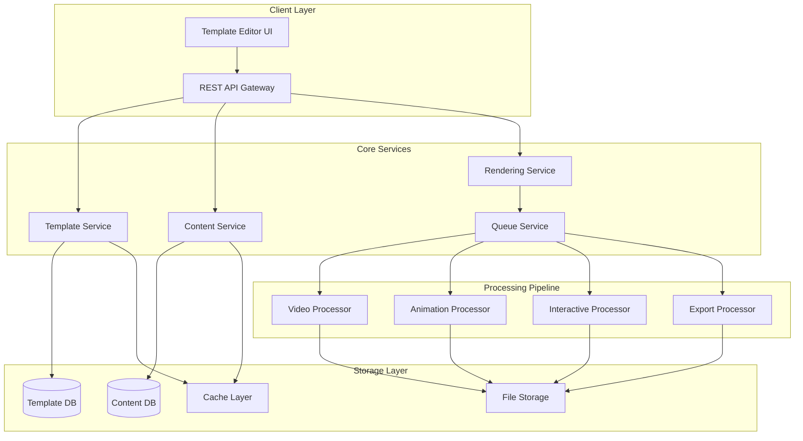

# Design Document: Advanced Video Template Engine

## Overview

The Advanced Video Template Engine is a sophisticated system that enables users to create reusable video templates with dynamic content insertion, multi-format output generation, and interactive elements. The system follows a microservices architecture pattern inspired by modern video processing pipelines, providing scalability, fault tolerance, and independent component scaling.

The engine transforms static templates into dynamic video content through a distributed rendering pipeline that supports multiple output formats, quality presets, and interactive features like chapters, annotations, and clickable elements.

## Architecture

### High-Level Architecture



### Microservices Architecture

The system is built using a microservices approach with the following key services:

1. **Template Service**: Manages template creation, storage, and versioning
2. **Content Service**: Handles dynamic content validation and processing
3. **Rendering Service**: Orchestrates the video generation pipeline
4. **Queue Service**: Manages job queuing and distributed processing
5. **Export Service**: Handles multi-format output generation
6. **Interactive Service**: Processes interactive elements and metadata

## Components and Interfaces

### Template Service

**Responsibilities:**
- Template CRUD operations
- Version control and rollback
- Template validation and structure verification
- Template sharing and collaboration features

**Key Interfaces:**
```typescript
interface TemplateService {
  createTemplate(template: TemplateDefinition): Promise<Template>
  updateTemplate(id: string, updates: Partial<TemplateDefinition>): Promise<Template>
  getTemplate(id: string, version?: string): Promise<Template>
  validateTemplate(template: TemplateDefinition): ValidationResult
  shareTemplate(id: string, permissions: SharingPermissions): Promise<ShareLink>
}

interface TemplateDefinition {
  name: string
  description: string
  duration: number
  resolution: Resolution
  contentSlots: ContentSlot[]
  animations: Animation[]
  interactiveElements: InteractiveElement[]
  metadata: TemplateMetadata
}
```

### Content Service

**Responsibilities:**
- Content slot validation and compatibility checking
- Dynamic content processing and optimization
- Batch content management for multiple video generation
- Content caching and optimization

**Key Interfaces:**
```typescript
interface ContentService {
  validateContent(slotId: string, content: ContentItem): ValidationResult
  processContent(content: ContentItem, requirements: SlotRequirements): Promise<ProcessedContent>
  batchProcessContent(contentSets: ContentSet[]): Promise<ProcessedContent[]>
  optimizeContent(content: ContentItem, targetSpecs: OutputSpecs): Promise<OptimizedContent>
}

interface ContentSlot {
  id: string
  type: 'text' | 'image' | 'video' | 'audio'
  position: Position
  dimensions: Dimensions
  duration?: number
  constraints: SlotConstraints
}
```

### Rendering Pipeline

**Responsibilities:**
- Orchestrating the video generation process
- Managing distributed chunk-based rendering
- Progress tracking and error handling
- Quality assurance and validation

**Key Components:**

1. **Video Processor**: Handles core video composition and effects
2. **Animation Processor**: Manages keyframe animations and transitions
3. **Interactive Processor**: Embeds interactive metadata and WebVTT tracks
4. **Export Processor**: Generates multiple output formats simultaneously

```typescript
interface RenderingPipeline {
  renderVideo(template: Template, content: ContentSet, specs: OutputSpecs[]): Promise<RenderJob>
  getProgress(jobId: string): Promise<RenderProgress>
  cancelJob(jobId: string): Promise<void>
  retryFailedChunks(jobId: string): Promise<void>
}

interface RenderJob {
  id: string
  status: 'queued' | 'processing' | 'completed' | 'failed'
  progress: number
  estimatedCompletion: Date
  outputs: OutputFile[]
  errors?: RenderError[]
}
```

## Data Models

### Template Data Model

```typescript
interface Template {
  id: string
  name: string
  description: string
  version: string
  createdAt: Date
  updatedAt: Date
  createdBy: string
  
  // Template Structure
  duration: number
  resolution: Resolution
  frameRate: number
  
  // Content Definition
  contentSlots: ContentSlot[]
  staticAssets: StaticAsset[]
  
  // Animation Definition
  animations: Animation[]
  transitions: Transition[]
  
  // Interactive Elements
  chapters: Chapter[]
  annotations: Annotation[]
  hotspots: Hotspot[]
  
  // Metadata
  tags: string[]
  category: string
  thumbnail: string
  previewVideo?: string
}

interface Animation {
  id: string
  targetSlotId: string
  type: 'motion' | 'scale' | 'rotation' | 'opacity' | 'color'
  keyframes: Keyframe[]
  easing: EasingFunction
  duration: number
  delay: number
}

interface InteractiveElement {
  id: string
  type: 'chapter' | 'annotation' | 'hotspot'
  timestamp: number
  duration?: number
  position?: Position
  data: any
}
```

### Content Data Model

```typescript
interface ContentSet {
  templateId: string
  name: string
  contentItems: Map<string, ContentItem>
  metadata: ContentMetadata
}

interface ContentItem {
  slotId: string
  type: 'text' | 'image' | 'video' | 'audio'
  data: any
  metadata: ItemMetadata
}

interface ProcessedContent extends ContentItem {
  optimizedData: any
  processingMetadata: ProcessingMetadata
  validationResult: ValidationResult
}
```

### Output Data Model

```typescript
interface OutputSpecs {
  format: 'mp4' | 'webm' | 'mov'
  resolution: Resolution
  quality: QualityPreset
  compression: CompressionSettings
  interactive: boolean
}

interface OutputFile {
  id: string
  format: string
  resolution: Resolution
  fileSize: number
  duration: number
  url: string
  downloadUrl: string
  metadata: OutputMetadata
  interactivePackage?: InteractivePackage
}

interface InteractivePackage {
  videoFile: string
  webvttTracks: WebVTTTrack[]
  hotspotData: HotspotData[]
  chapterMarkers: ChapterMarker[]
  playerConfig: PlayerConfiguration
}
```

## Correctness Properties

*A property is a characteristic or behavior that should hold true across all valid executions of a system-essentially, a formal statement about what the system should do. Properties serve as the bridge between human-readable specifications and machine-verifiable correctness guarantees.*

Based on the prework analysis, I've identified the following testable properties that can be validated through property-based testing:

### Property Reflection

After reviewing all properties identified in the prework, I've consolidated related properties and eliminated redundancy:

- Properties 2.1 and 8.4 both deal with content slot validation - combined into Property 1
- Properties 3.1, 3.2, and 3.3 all relate to multi-format output - combined into Property 2  
- Properties 4.1, 4.2, and 4.3 all cover interactive element types - combined into Property 3
- Properties 7.1 and 7.2 both address job processing and distribution - combined into Property 4

### Core Properties

**Property 1: Content Slot Compatibility**
*For any* template with defined content slots and any content item, the system should correctly validate content compatibility with slot requirements and ensure all required slots are properly filled during video generation
**Validates: Requirements 1.2, 2.1, 2.2, 8.4**

**Property 2: Multi-Format Output Generation**
*For any* template and content set, when multiple output formats are requested, the system should generate all requested format variations with correct specifications and provide proper metadata for each
**Validates: Requirements 3.1, 3.2, 3.3, 3.4**

**Property 3: Interactive Element Integration**
*For any* template containing interactive elements (hotspots, chapters, annotations), the system should properly store, retrieve, and embed these elements in both standard and interactive video outputs
**Validates: Requirements 4.1, 4.2, 4.3, 4.4, 4.5**

**Property 4: Template Persistence and Versioning**
*For any* template modification, the system should preserve version history, allow rollback to previous versions, and maintain data integrity across all operations
**Validates: Requirements 1.3, 1.4**

**Property 5: Content Processing and Optimization**
*For any* content that exceeds slot constraints, the system should automatically resize or trim the content while maintaining aspect ratios and quality standards
**Validates: Requirements 2.3**

**Property 6: Batch Processing Consistency**
*For any* template and multiple content sets, batch processing should generate videos with consistent quality and structure, with each video containing the correct content mapping
**Validates: Requirements 2.4, 2.5**

**Property 7: Animation Adaptation**
*For any* content slot with animations, the system should automatically adapt animations to dynamic content dimensions while preserving the intended visual effects
**Validates: Requirements 5.2, 5.3, 5.4**

**Property 8: Template Sharing and Import**
*For any* exported template package, importing it should preserve all template components, resolve dependencies, and maintain proper attribution and permissions
**Validates: Requirements 6.1, 6.2, 6.4**

**Property 9: Job Processing and Distribution**
*For any* set of video generation requests, the system should properly queue jobs, distribute tasks across resources, and provide accurate progress tracking with retry mechanisms for failures
**Validates: Requirements 7.1, 7.2, 7.3, 7.4**

**Property 10: Caching Optimization**
*For any* frequently used template components, the system should cache them appropriately and demonstrate improved generation speed on subsequent uses
**Validates: Requirements 7.5**

**Property 11: Quality Validation**
*For any* generated video, the system should validate audio-video synchronization, verify technical specifications, and provide detailed quality reports
**Validates: Requirements 8.1, 8.2, 8.5**

**Property 12: Template Structure Validation**
*For any* template configuration, the system should validate the structure and provide appropriate error feedback for invalid configurations
**Validates: Requirements 1.5**

**Property 13: Collaborative Editing**
*For any* concurrent template modifications by multiple users, the system should handle conflicts appropriately and maintain template integrity
**Validates: Requirements 6.3**

**Property 14: Template Discovery**
*For any* template in the marketplace, it should be properly indexed and discoverable through search functionality
**Validates: Requirements 6.5**

## Error Handling

### Error Categories

1. **Template Validation Errors**
   - Invalid template structure
   - Missing required components
   - Circular dependencies in animations
   - Incompatible slot configurations

2. **Content Processing Errors**
   - Unsupported content formats
   - Content size/duration violations
   - Corrupted media files
   - Missing content for required slots

3. **Rendering Pipeline Errors**
   - Resource allocation failures
   - Processing timeouts
   - Memory limitations
   - Codec compatibility issues

4. **Export and Distribution Errors**
   - Storage capacity issues
   - Network connectivity problems
   - Format conversion failures
   - Interactive metadata corruption

### Error Recovery Strategies

- **Automatic Retry**: Failed rendering jobs are automatically retried with exponential backoff
- **Graceful Degradation**: If interactive features fail, system falls back to standard video output
- **Partial Recovery**: Batch jobs continue processing remaining items if individual items fail
- **User Notification**: Clear error messages with actionable suggestions for resolution

## Testing Strategy

### Dual Testing Approach

The system requires both unit testing and property-based testing for comprehensive coverage:

**Unit Tests** focus on:
- Specific template configurations and edge cases
- Error conditions and boundary values
- Integration points between microservices
- Interactive element rendering accuracy

**Property-Based Tests** focus on:
- Universal properties across all template types
- Content compatibility validation across random inputs
- Multi-format output consistency
- Animation adaptation across various content dimensions

### Property-Based Testing Configuration

- **Testing Framework**: Hypothesis (Python) for backend services, fast-check (TypeScript) for frontend components
- **Test Iterations**: Minimum 100 iterations per property test
- **Test Tagging**: Each property test tagged with format: **Feature: advanced-video-template-engine, Property {number}: {property_text}**
- **Coverage Requirements**: Each correctness property implemented by exactly one property-based test

### Testing Infrastructure

- **Distributed Testing**: Tests run across multiple environments to validate scalability
- **Performance Benchmarking**: Automated performance tests for rendering pipeline optimization
- **Visual Regression Testing**: Automated comparison of generated video outputs
- **Interactive Feature Testing**: Validation of WebVTT tracks and interactive metadata
```

Now I need to use the prework tool to analyze the acceptance criteria before writing the correctness properties:

<function_calls>
<invoke name="prework">
<parameter name="featureName">advanced-video-template-engine