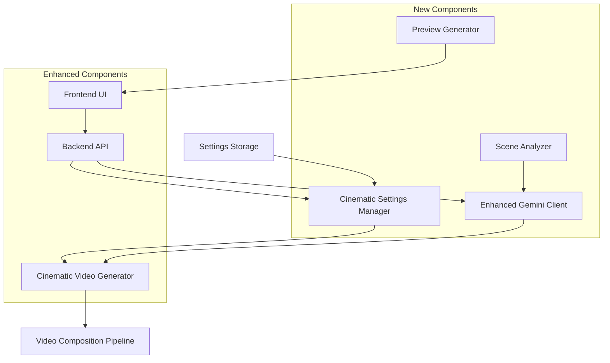

# Design Document

## Overview

This design document outlines the architecture and implementation approach for enhancing the RASO cinematic production system with user interface controls for cinematic feature selection and AI-powered detailed visual descriptions using Google Gemini integration.

The enhancement builds upon the existing cinematic video generation system (`src/agents/cinematic_video_generator.py`) and Gemini LLM integration (`src/llm/gemini_client.py`) to provide users with intuitive controls for customizing cinematic features and generating sophisticated visual descriptions for enhanced video production.

## Architecture

### System Components

The enhanced system consists of the following key components:



### Component Interactions

1. **Frontend UI** provides cinematic feature selection controls and displays real-time previews
2. **Backend API** handles cinematic settings management and coordinates with enhanced services
3. **Cinematic Settings Manager** manages user preferences, profiles, and validation
4. **Enhanced Gemini Client** generates detailed visual descriptions and scene analysis
5. **Preview Generator** creates real-time previews of cinematic effects
6. **Scene Analyzer** analyzes content to suggest optimal cinematic settings

## Components and Interfaces

### Frontend Components

#### CinematicControlPanel Component
```typescript
interface CinematicControlPanelProps {
  settings: CinematicSettings;
  onSettingsChange: (settings: CinematicSettings) => void;
  onPreviewRequest: (feature: string) => void;
  previewImages: Record<string, string>;
  isGenerating: boolean;
}

interface CinematicSettings {
  cameraMovements: {
    enabled: boolean;
    types: CameraMovementType[];
    intensity: number; // 0-100
  };
  colorGrading: {
    enabled: boolean;
    filmEmulation: 'none' | 'kodak' | 'fuji' | 'cinema';
    temperature: number; // -100 to 100
    tint: number; // -100 to 100
    contrast: number; // -100 to 100
    saturation: number; // -100 to 100
  };
  soundDesign: {
    enabled: boolean;
    ambientAudio: boolean;
    musicScoring: boolean;
    spatialAudio: boolean;
    reverbIntensity: number; // 0-100
  };
  advancedCompositing: {
    enabled: boolean;
    filmGrain: boolean;
    dynamicLighting: boolean;
    depthOfField: boolean;
    motionBlur: boolean;
  };
  qualityPreset: 'standard_hd' | 'cinematic_4k' | 'cinematic_8k';
}
```

#### VisualDescriptionEditor Component
```typescript
interface VisualDescriptionEditorProps {
  sceneContent: string;
  currentDescription: string;
  onDescriptionChange: (description: string) => void;
  onGenerateDescription: () => void;
  isGenerating: boolean;
  suggestions: string[];
}
```

#### CinematicProfileManager Component
```typescript
interface CinematicProfile {
  id: string;
  name: string;
  description: string;
  settings: CinematicSettings;
  createdAt: Date;
  lastUsed: Date;
  isDefault: boolean;
}

interface CinematicProfileManagerProps {
  profiles: CinematicProfile[];
  currentProfile: CinematicProfile | null;
  onProfileSelect: (profile: CinematicProfile) => void;
  onProfileSave: (profile: Omit<CinematicProfile, 'id' | 'createdAt'>) => void;
  onProfileDelete: (profileId: string) => void;
  onProfileExport: (profileId: string) => void;
  onProfileImport: (profileData: string) => void;
}
```

### Backend API Interfaces

#### Cinematic Settings API
```typescript
// POST /api/v1/cinematic/settings
interface SaveCinematicSettingsRequest {
  settings: CinematicSettings;
  profileName?: string;
  setAsDefault?: boolean;
}

interface SaveCinematicSettingsResponse {
  success: boolean;
  profileId?: string;
  message: string;
}

// GET /api/v1/cinematic/settings/{profileId}
interface GetCinematicSettingsResponse {
  profile: CinematicProfile;
  settings: CinematicSettings;
}

// POST /api/v1/cinematic/preview
interface GeneratePreviewRequest {
  settings: CinematicSettings;
  feature: string; // 'color_grading', 'camera_movement', etc.
  sampleContent?: string;
}

interface GeneratePreviewResponse {
  previewUrl: string;
  thumbnailUrl: string;
  estimatedProcessingTime: number;
  estimatedFileSize: number;
}
```

#### Enhanced Visual Description API
```typescript
// POST /api/v1/cinematic/visual-description
interface GenerateVisualDescriptionRequest {
  sceneContent: string;
  sceneType: 'intro' | 'methodology' | 'results' | 'conclusion' | 'general';
  cinematicSettings: CinematicSettings;
  targetAudience: 'beginner' | 'intermediate' | 'advanced';
  previousDescriptions?: string[]; // For consistency
}

interface GenerateVisualDescriptionResponse {
  description: string;
  suggestions: string[];
  sceneAnalysis: {
    mood: string;
    complexity: string;
    recommendedCameraMovement: string;
    recommendedColorGrading: string;
    visualElements: string[];
  };
  confidence: number; // 0-100
}

// POST /api/v1/cinematic/scene-analysis
interface AnalyzeSceneRequest {
  content: string;
  contentType: 'title' | 'abstract' | 'full_text';
}

interface AnalyzeSceneResponse {
  analysis: SceneAnalysis;
  recommendations: CinematicRecommendations;
}

interface SceneAnalysis {
  mood: string;
  complexity: 'low' | 'medium' | 'high';
  pacing: 'slow' | 'medium' | 'fast';
  focusType: 'mathematical' | 'architectural' | 'analytical' | 'procedural' | 'general';
  keyTerms: string[];
  technicalLevel: 'beginner' | 'intermediate' | 'advanced';
}

interface CinematicRecommendations {
  cameraMovement: {
    type: string;
    reasoning: string;
    confidence: number;
  };
  colorGrading: {
    filmEmulation: string;
    adjustments: Record<string, number>;
    reasoning: string;
    confidence: number;
  };
  soundDesign: {
    approach: string;
    elements: string[];
    reasoning: string;
    confidence: number;
  };
}
```

### Enhanced Gemini Client Interface

```python
class EnhancedGeminiClient(GeminiClient):
    """Enhanced Gemini client with cinematic visual description capabilities."""
    
    async def generate_detailed_visual_description(
        self,
        scene_content: str,
        scene_type: str,
        cinematic_settings: Dict[str, Any],
        target_audience: str = "intermediate",
        previous_descriptions: List[str] = None
    ) -> Dict[str, Any]:
        """Generate detailed visual description for cinematic production."""
        pass
    
    async def analyze_scene_for_cinematics(
        self,
        content: str,
        content_type: str = "text"
    ) -> Dict[str, Any]:
        """Analyze scene content to recommend optimal cinematic settings."""
        pass
    
    async def generate_visual_consistency_analysis(
        self,
        descriptions: List[str],
        overall_theme: str
    ) -> Dict[str, Any]:
        """Analyze visual descriptions for consistency across scenes."""
        pass
    
    async def suggest_cinematic_improvements(
        self,
        current_description: str,
        cinematic_settings: Dict[str, Any]
    ) -> Dict[str, Any]:
        """Suggest improvements to visual descriptions based on cinematic settings."""
        pass
```

### Cinematic Settings Manager

```python
class CinematicSettingsManager:
    """Manages cinematic settings, profiles, and validation."""
    
    def __init__(self, storage_backend: str = "file"):
        self.storage = self._initialize_storage(storage_backend)
        self.validator = CinematicSettingsValidator()
    
    async def save_profile(
        self,
        profile_name: str,
        settings: Dict[str, Any],
        user_id: str = "default",
        set_as_default: bool = False
    ) -> str:
        """Save cinematic settings profile."""
        pass
    
    async def load_profile(
        self,
        profile_id: str,
        user_id: str = "default"
    ) -> Dict[str, Any]:
        """Load cinematic settings profile."""
        pass
    
    async def get_user_profiles(
        self,
        user_id: str = "default"
    ) -> List[Dict[str, Any]]:
        """Get all profiles for a user."""
        pass
    
    async def validate_settings(
        self,
        settings: Dict[str, Any]
    ) -> Dict[str, Any]:
        """Validate cinematic settings and return validation result."""
        pass
    
    async def get_recommendations(
        self,
        scene_analysis: Dict[str, Any]
    ) -> Dict[str, Any]:
        """Get cinematic setting recommendations based on scene analysis."""
        pass
```

## Data Models

### Cinematic Settings Schema

```python
from dataclasses import dataclass
from typing import Dict, List, Optional, Union
from enum import Enum

class CameraMovementType(Enum):
    STATIC = "static"
    PAN = "pan"
    ZOOM = "zoom"
    DOLLY = "dolly"
    CRANE = "crane"
    HANDHELD = "handheld"

class FilmEmulationType(Enum):
    NONE = "none"
    KODAK = "kodak"
    FUJI = "fuji"
    CINEMA = "cinema"

@dataclass
class CameraMovementSettings:
    enabled: bool = True
    allowed_types: List[CameraMovementType] = None
    intensity: int = 50  # 0-100
    auto_select: bool = True
    
    def __post_init__(self):
        if self.allowed_types is None:
            self.allowed_types = list(CameraMovementType)

@dataclass
class ColorGradingSettings:
    enabled: bool = True
    film_emulation: FilmEmulationType = FilmEmulationType.NONE
    temperature: int = 0  # -100 to 100
    tint: int = 0  # -100 to 100
    contrast: int = 0  # -100 to 100
    saturation: int = 0  # -100 to 100
    brightness: int = 0  # -100 to 100
    shadows: int = 0  # -100 to 100
    highlights: int = 0  # -100 to 100
    auto_adjust: bool = True

@dataclass
class SoundDesignSettings:
    enabled: bool = True
    ambient_audio: bool = True
    music_scoring: bool = True
    spatial_audio: bool = False
    reverb_intensity: int = 30  # 0-100
    eq_processing: bool = True
    dynamic_range_compression: bool = True
    auto_select_music: bool = True

@dataclass
class AdvancedCompositingSettings:
    enabled: bool = True
    film_grain: bool = True
    dynamic_lighting: bool = True
    depth_of_field: bool = False
    motion_blur: bool = False
    professional_transitions: bool = True
    lut_application: bool = True

@dataclass
class CinematicSettingsModel:
    camera_movements: CameraMovementSettings
    color_grading: ColorGradingSettings
    sound_design: SoundDesignSettings
    advanced_compositing: AdvancedCompositingSettings
    quality_preset: str = "cinematic_4k"
    auto_recommendations: bool = True
    
    def to_dict(self) -> Dict[str, Any]:
        """Convert to dictionary for serialization."""
        pass
    
    @classmethod
    def from_dict(cls, data: Dict[str, Any]) -> 'CinematicSettingsModel':
        """Create from dictionary."""
        pass
    
    def validate(self) -> List[str]:
        """Validate settings and return list of errors."""
        pass
```

### Visual Description Schema

```python
@dataclass
class VisualDescriptionModel:
    scene_id: str
    content: str
    description: str
    generated_by: str  # "user", "gemini", "template"
    cinematic_settings: Dict[str, Any]
    scene_analysis: Dict[str, Any]
    suggestions: List[str]
    confidence: float
    created_at: str
    updated_at: str
    
    def to_dict(self) -> Dict[str, Any]:
        """Convert to dictionary for serialization."""
        pass
    
    @classmethod
    def from_dict(cls, data: Dict[str, Any]) -> 'VisualDescriptionModel':
        """Create from dictionary."""
        pass
```

### Profile Schema

```python
@dataclass
class CinematicProfileModel:
    id: str
    name: str
    description: str
    settings: CinematicSettingsModel
    user_id: str
    is_default: bool
    is_system: bool  # System-provided profiles
    created_at: str
    last_used: str
    usage_count: int
    
    def to_dict(self) -> Dict[str, Any]:
        """Convert to dictionary for serialization."""
        pass
    
    @classmethod
    def from_dict(cls, data: Dict[str, Any]) -> 'CinematicProfileModel':
        """Create from dictionary."""
        pass
```

## Correctness Properties

*A property is a characteristic or behavior that should hold true across all valid executions of a system-essentially, a formal statement about what the system should do. Properties serve as the bridge between human-readable specifications and machine-verifiable correctness guarantees.*

Before writing the correctness properties, I need to analyze the acceptance criteria from the requirements document to determine which ones are testable as properties, examples, or edge cases.

### Property-Based Testing Overview

Property-based testing validates software correctness by testing universal properties across many generated inputs. Each property is a formal specification that should hold for all valid inputs.

### Correctness Properties

Based on the prework analysis and property reflection to eliminate redundancy, the following properties must hold for the cinematic UI enhancement system:

**Property 1: UI Component Completeness**
*For any* cinematic features panel display, all required UI elements (camera movement toggles, color grading controls, sound design options, quality presets, and tooltips) should be present and functional
**Validates: Requirements 1.2, 1.4, 1.5, 3.4**

**Property 2: Settings State Management**
*For any* user interaction with cinematic feature toggles or controls, the system should update the configuration state and provide appropriate visual feedback
**Validates: Requirements 1.3**

**Property 3: Settings Persistence Round-Trip**
*For any* valid cinematic settings configuration, saving and then loading the settings should produce an equivalent configuration
**Validates: Requirements 1.6, 3.3, 2.7**

**Property 4: Default State Restoration**
*For any* current cinematic settings state, applying the reset function should restore the system to the predefined default recommended settings
**Validates: Requirements 1.7**

**Property 5: Gemini Visual Description Generation**
*For any* valid scene content, the system should use Gemini to generate detailed visual descriptions that include technical content analysis, mood assessment, and target audience considerations
**Validates: Requirements 2.1, 2.2, 5.1**

**Property 6: Visual Description Format Compliance**
*For any* generated visual description, it should contain specific cinematic details (camera angles, lighting, composition, visual elements) and be formatted for use by the cinematic video generator
**Validates: Requirements 2.3, 2.4**

**Property 7: Multi-Scene Visual Consistency**
*For any* set of related scenes processed together, the generated visual descriptions should maintain consistency in visual themes and narrative flow
**Validates: Requirements 2.5, 5.5**

**Property 8: Profile Management Completeness**
*For any* cinematic settings configuration, the system should allow creating a named profile that stores all feature selections, quality settings, and preferences
**Validates: Requirements 3.1, 3.2**

**Property 9: Profile Operations Integrity**
*For any* saved profile, deletion should remove it from storage and UI, while export should create a valid shareable configuration file
**Validates: Requirements 3.5, 3.7**

**Property 10: Preview Generation Responsiveness**
*For any* cinematic feature selection or settings change, the system should generate appropriate preview content (thumbnails for features, animated previews for camera movements, updated estimates for quality changes)
**Validates: Requirements 4.1, 4.2, 4.3, 4.4, 4.5**

**Property 11: Preview Caching Efficiency**
*For any* generated preview content, subsequent identical requests should use cached versions rather than regenerating the content
**Validates: Requirements 4.7, 8.3**

**Property 12: Content-Aware Recommendations**
*For any* content type (mathematical, architectural, performance, introductory, conclusion), the system should generate appropriate cinematic recommendations and visual descriptions that match the content characteristics
**Validates: Requirements 5.2, 5.3, 5.4, 6.1, 6.2, 6.3, 6.4, 6.5**

**Property 13: Recommendation Application**
*For any* Gemini-generated suggestions with explanations, accepting the suggestions should automatically apply the recommended settings to the current configuration
**Validates: Requirements 5.6, 5.7**

**Property 14: Content Classification and Template Application**
*For any* ambiguous content, the system should use Gemini to classify the content type and apply appropriate templates that remain customizable and editable
**Validates: Requirements 6.6, 6.7**

**Property 15: Backward Compatibility Preservation**
*For any* existing video generation workflow, the enhanced system should maintain functionality when new cinematic features are disabled or when using existing configuration files
**Validates: Requirements 7.1, 7.5, 7.6**

**Property 16: Error Handling and Fallback Robustness**
*For any* external service failure (Gemini API unavailable, preview generation failure, API quota exceeded), the system should provide appropriate fallback functionality and clear user feedback without breaking core video generation
**Validates: Requirements 2.6, 4.6, 7.2, 7.7, 8.7**

**Property 17: Component Integration Compatibility**
*For any* new visual descriptions or cinematic settings, they should be compatible with existing video composition agents, quality presets, and output formats
**Validates: Requirements 7.3, 7.4**

**Property 18: API Rate Limiting and Caching**
*For any* Gemini API usage, the system should implement appropriate rate limiting mechanisms and cache results to avoid redundant API calls
**Validates: Requirements 8.2, 8.3**

## Error Handling

### Error Categories

The system must handle the following error categories gracefully:

1. **External Service Failures**
   - Gemini API unavailable or rate limited
   - Network connectivity issues
   - Authentication failures

2. **User Input Validation Errors**
   - Invalid cinematic settings values
   - Malformed profile data
   - Unsupported content formats

3. **System Resource Constraints**
   - Insufficient storage for profiles/cache
   - Memory limitations during preview generation
   - Processing timeouts

4. **Integration Failures**
   - Incompatible settings with existing components
   - Version mismatches in configuration files
   - Missing dependencies

### Error Handling Strategies

#### Graceful Degradation
- When Gemini is unavailable, fall back to enhanced template-based descriptions
- When preview generation fails, show placeholder previews with descriptive text
- When advanced features fail, ensure core video generation continues

#### User Feedback
- Provide clear, actionable error messages
- Show progress indicators for long-running operations
- Offer retry mechanisms for transient failures

#### Fallback Mechanisms
- Template-based visual descriptions when AI generation fails
- Default cinematic settings when profile loading fails
- Cached results when real-time generation is unavailable

## Testing Strategy

### Dual Testing Approach

The testing strategy employs both unit testing and property-based testing to ensure comprehensive coverage:

**Unit Tests:**
- Test specific UI component rendering and interactions
- Validate API endpoint responses and error conditions
- Test individual service methods with known inputs
- Verify integration points between components

**Property-Based Tests:**
- Validate universal properties across all valid inputs using Hypothesis (Python) and fast-check (TypeScript)
- Test cinematic settings persistence and retrieval with randomly generated configurations
- Verify visual description generation with various content types
- Test error handling with simulated failure conditions

### Property Test Configuration

- **Minimum 100 iterations** per property test due to randomization
- Each property test references its design document property using the tag format:
  - **Feature: cinematic-ui-enhancement, Property 1: UI Component Completeness**
- Tests generate random but valid inputs within defined constraints
- Edge cases and boundary conditions are explicitly tested

### Test Data Generation

**Cinematic Settings Generators:**
- Generate valid combinations of camera movements, color grading, and sound design settings
- Create edge cases with extreme but valid parameter values
- Test with disabled features and minimal configurations

**Content Generators:**
- Generate various types of academic and technical content
- Create content with different complexity levels and technical terminology
- Test with edge cases like very short or very long content

**Profile Data Generators:**
- Generate valid profile configurations with different naming patterns
- Create profiles with various combinations of enabled/disabled features
- Test with boundary cases for profile metadata

### Integration Testing

**Frontend-Backend Integration:**
- Test complete user workflows from UI interaction to backend processing
- Verify real-time preview generation and caching
- Test profile management operations end-to-end

**Gemini Integration Testing:**
- Test with actual Gemini API calls (rate-limited for CI/CD)
- Verify fallback behavior when API is unavailable
- Test with various content types and complexity levels

**Existing System Integration:**
- Verify compatibility with existing video generation pipeline
- Test that new features don't break existing functionality
- Validate that enhanced descriptions work with current video composition agents

### Performance Testing

**Load Testing:**
- Test concurrent user access to cinematic features
- Verify system behavior under high API request volumes
- Test preview generation performance with multiple simultaneous requests

**Caching Validation:**
- Verify that preview and description caching reduces API calls
- Test cache invalidation when settings change
- Validate cache performance under various load conditions

### Test Environment Setup

**Development Environment:**
- Mock Gemini API for fast, reliable unit tests
- Local storage backend for profile management testing
- Simplified preview generation for rapid feedback

**Staging Environment:**
- Real Gemini API integration with rate limiting
- Full preview generation pipeline testing
- End-to-end workflow validation

**Production Environment:**
- Monitoring and alerting for API failures
- Performance metrics collection
- User experience analytics

This comprehensive testing strategy ensures that the cinematic UI enhancement system maintains high quality, reliability, and performance while providing users with powerful tools for creating professional cinematic videos.

### YouTube Optimization Components

#### YouTubeOptimizer Component
```typescript
interface YouTubeOptimizerProps {
  enabled: boolean;
  contentType: 'educational' | 'entertainment' | 'tutorial' | 'review';
  targetAudience: 'general' | 'technical' | 'academic';
  onOptimizationChange: (settings: YouTubeOptimizationSettings) => void;
}

interface YouTubeOptimizationSettings {
  aspectRatio: '16:9' | '9:16' | '1:1';
  targetDuration: {
    min: number; // minutes
    max: number; // minutes
  };
  thumbnailGeneration: {
    enabled: boolean;
    style: 'professional' | 'engaging' | 'educational';
    includeText: boolean;
    brandingElements: boolean;
  };
  seoOptimization: {
    generateTitle: boolean;
    generateDescription: boolean;
    generateTags: boolean;
    includeTimestamps: boolean;
  };
  engagement: {
    addIntro: boolean;
    addOutro: boolean;
    addChapterMarkers: boolean;
    addCallToAction: boolean;
  };
}
```

#### SocialMediaAdapter Component
```typescript
interface SocialMediaAdapterProps {
  platforms: SocialPlatform[];
  onPlatformSettingsChange: (platform: SocialPlatform, settings: PlatformSettings) => void;
}

interface SocialPlatform {
  name: 'youtube' | 'instagram' | 'tiktok' | 'linkedin' | 'twitter';
  enabled: boolean;
  settings: PlatformSettings;
}

interface PlatformSettings {
  aspectRatio: string;
  maxDuration: number; // seconds
  maxFileSize: number; // MB
  recommendedResolution: string;
  audioRequirements: {
    codec: string;
    bitrate: string;
    sampleRate: number;
  };
  videoRequirements: {
    codec: string;
    profile: string;
    pixelFormat: string;
  };
  contentOptimizations: {
    pacingMultiplier: number; // 1.0 = normal, >1.0 = faster
    visualDensity: 'low' | 'medium' | 'high';
    textSize: 'small' | 'medium' | 'large';
    subtitlesRequired: boolean;
  };
}
```

#### AccessibilityController Component
```typescript
interface AccessibilityControllerProps {
  settings: AccessibilitySettings;
  onSettingsChange: (settings: AccessibilitySettings) => void;
  contentAnalysis: ContentAccessibilityAnalysis;
}

interface AccessibilitySettings {
  closedCaptions: {
    enabled: boolean;
    language: string;
    style: 'standard' | 'large' | 'high-contrast';
    position: 'bottom' | 'top' | 'custom';
  };
  audioDescriptions: {
    enabled: boolean;
    verbosity: 'minimal' | 'standard' | 'detailed';
  };
  visualAccessibility: {
    highContrast: boolean;
    colorBlindFriendly: boolean;
    avoidFlashing: boolean;
    textSize: 'standard' | 'large' | 'extra-large';
  };
  cognitiveAccessibility: {
    simplifiedLanguage: boolean;
    clearStructure: boolean;
    consistentNavigation: boolean;
  };
}

interface ContentAccessibilityAnalysis {
  colorContrastRatio: number;
  flashingContent: boolean;
  textReadability: number; // Flesch reading score
  audioClarity: number; // dB signal-to-noise ratio
  visualComplexity: 'low' | 'medium' | 'high';
  recommendations: string[];
}
```

### Enhanced Backend API Interfaces

#### YouTube Optimization API
```typescript
// POST /api/v1/cinematic/youtube-optimize
interface YouTubeOptimizeRequest {
  contentType: string;
  targetAudience: string;
  currentSettings: CinematicSettings;
  videoMetadata: {
    title: string;
    description?: string;
    duration: number;
  };
}

interface YouTubeOptimizeResponse {
  optimizedSettings: CinematicSettings;
  encodingParams: EncodingParams;
  thumbnailSuggestions: ThumbnailSuggestion[];
  seoRecommendations: {
    title: string;
    description: string;
    tags: string[];
    chapterMarkers: ChapterMarker[];
  };
  engagementFeatures: {
    introSuggestion: string;
    outroSuggestion: string;
    callToActionText: string;
  };
}

interface ThumbnailSuggestion {
  timestamp: number; // seconds into video
  description: string;
  visualElements: string[];
  textOverlay?: string;
  confidence: number;
}

interface ChapterMarker {
  timestamp: number;
  title: string;
  description: string;
}
```

#### Multi-Platform Export API
```typescript
// POST /api/v1/cinematic/multi-platform-export
interface MultiPlatformExportRequest {
  platforms: SocialPlatform[];
  baseSettings: CinematicSettings;
  contentMetadata: {
    title: string;
    description: string;
    tags: string[];
  };
}

interface MultiPlatformExportResponse {
  exportJobs: PlatformExportJob[];
  estimatedProcessingTime: number;
  totalEstimatedSize: number;
}

interface PlatformExportJob {
  platform: string;
  jobId: string;
  settings: CinematicSettings;
  encodingParams: EncodingParams;
  adaptations: ContentAdaptation[];
}

interface ContentAdaptation {
  type: 'aspect_ratio' | 'duration' | 'pacing' | 'text_size' | 'visual_density';
  originalValue: any;
  adaptedValue: any;
  reason: string;
}
```

#### Accessibility API
```typescript
// POST /api/v1/cinematic/accessibility-analyze
interface AccessibilityAnalyzeRequest {
  videoContent: string; // base64 or URL
  audioContent: string; // base64 or URL
  textContent: string[];
  targetCompliance: 'WCAG_AA' | 'WCAG_AAA' | 'Section_508';
}

interface AccessibilityAnalyzeResponse {
  analysis: ContentAccessibilityAnalysis;
  complianceScore: number; // 0-100
  violations: AccessibilityViolation[];
  recommendations: AccessibilityRecommendation[];
  autoFixAvailable: boolean;
}

interface AccessibilityViolation {
  type: string;
  severity: 'low' | 'medium' | 'high' | 'critical';
  description: string;
  location: string; // timestamp or element
  wcagReference: string;
}

interface AccessibilityRecommendation {
  type: string;
  description: string;
  implementation: string;
  estimatedEffort: 'low' | 'medium' | 'high';
  complianceImpact: number; // points improvement
}
```

### Enhanced Data Models

#### YouTube Optimization Schema
```python
@dataclass
class YouTubeOptimizationModel:
    content_type: str
    target_audience: str
    aspect_ratio: str
    target_duration_range: Tuple[int, int]  # (min, max) in seconds
    thumbnail_settings: Dict[str, Any]
    seo_settings: Dict[str, Any]
    engagement_settings: Dict[str, Any]
    encoding_optimizations: Dict[str, Any]
    
    def to_encoding_params(self) -> EncodingParams:
        """Convert to YouTube-optimized encoding parameters."""
        pass
    
    def generate_seo_metadata(self, content: str) -> Dict[str, Any]:
        """Generate SEO-optimized metadata using content analysis."""
        pass
```

#### Platform Adaptation Schema
```python
@dataclass
class PlatformAdaptationModel:
    platform: str
    original_settings: CinematicSettingsModel
    adapted_settings: CinematicSettingsModel
    adaptations_applied: List[Dict[str, Any]]
    quality_score: float  # 0-1, how well adapted for platform
    
    def validate_platform_compliance(self) -> List[str]:
        """Validate settings comply with platform requirements."""
        pass
```

#### Accessibility Compliance Schema
```python
@dataclass
class AccessibilityComplianceModel:
    target_standard: str  # 'WCAG_AA', 'WCAG_AAA', 'Section_508'
    compliance_score: float  # 0-100
    violations: List[Dict[str, Any]]
    recommendations: List[Dict[str, Any]]
    auto_fixes_available: List[str]
    
    def apply_auto_fixes(self, settings: CinematicSettingsModel) -> CinematicSettingsModel:
        """Apply automatic accessibility fixes to settings."""
        pass
```

### Additional Correctness Properties

**Property 19: YouTube Optimization Compliance**
*For any* content type and target audience, YouTube optimization should produce settings that comply with YouTube's technical requirements and best practices
**Validates: Requirements 9.1, 9.2, 9.5**

**Property 20: Multi-Platform Adaptation Consistency**
*For any* base cinematic settings, platform adaptations should maintain content quality while meeting each platform's specific requirements
**Validates: Requirements 10.1, 10.2, 10.3, 10.6**

**Property 21: Accessibility Standards Compliance**
*For any* accessibility settings configuration, the generated content should meet or exceed the specified compliance standard (WCAG AA/AAA)
**Validates: Requirements 11.1, 11.2, 11.4, 11.7**

**Property 22: SEO Metadata Generation Quality**
*For any* video content analysis, generated SEO metadata (titles, descriptions, tags) should be relevant, engaging, and optimized for search discovery
**Validates: Requirements 9.6**

**Property 23: Platform File Size Compliance**
*For any* platform export settings, the estimated output file size should not exceed the platform's maximum file size limits
**Validates: Requirements 10.6**