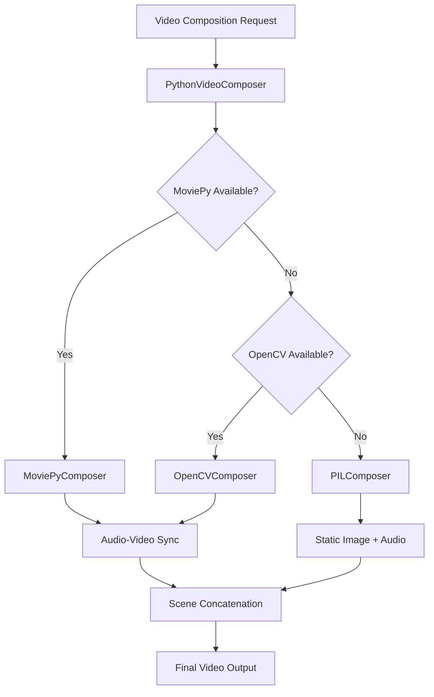

# Design Document

## Overview

This design implements a robust, FFmpeg-free video composition system for RASO that uses Python libraries to create playable videos from audio and animation assets. The system provides multiple fallback methods to ensure users always receive working video files, regardless of their system configuration.

## Architecture

### Core Components

```
FFmpeg-Free Video Composition System
├── PythonVideoComposer (Primary)
├── MoviePyComposer (High-quality method)
├── OpenCVComposer (Fallback method)
├── PILComposer (Minimal fallback)
└── LibraryManager (Dependency handling)
```

### Component Interaction Flow



## Components and Interfaces

### 1. PythonVideoComposer

**Purpose**: Main orchestrator for FFmpeg-free video composition

**Interface**:
```python
class PythonVideoComposer:
    def compose_video(self, audio_assets: AudioAssets, animation_assets: AnimationAssets, output_path: str) -> str
    def check_dependencies(self) -> Dict[str, bool]
    def install_dependencies(self) -> bool
```

**Responsibilities**:
- Detect available Python video libraries
- Route composition to appropriate method
- Handle library installation
- Coordinate fallback strategies

### 2. MoviePyComposer

**Purpose**: High-quality video composition using MoviePy library

**Interface**:
```python
class MoviePyComposer:
    def compose_scenes(self, scenes: List[SceneData]) -> VideoFileClip
    def sync_audio_video(self, video: VideoFileClip, audio: AudioFileClip) -> VideoFileClip
    def concatenate_scenes(self, scenes: List[VideoFileClip]) -> VideoFileClip
```

**Features**:
- Professional video composition
- Automatic audio-video synchronization
- Scene transitions and effects
- High-quality output

### 3. OpenCVComposer

**Purpose**: Fallback video composition using OpenCV

**Interface**:
```python
class OpenCVComposer:
    def create_video_from_images(self, images: List[np.ndarray], audio_path: str) -> str
    def extract_frames_from_animation(self, animation_path: str) -> List[np.ndarray]
    def add_audio_to_video(self, video_path: str, audio_path: str) -> str
```

**Features**:
- Frame-by-frame video creation
- Basic audio synchronization
- Reliable cross-platform support

### 4. PILComposer

**Purpose**: Minimal fallback using PIL/Pillow for image sequences

**Interface**:
```python
class PILComposer:
    def create_slideshow(self, titles: List[str], audio_paths: List[str]) -> str
    def generate_title_images(self, scene_titles: List[str]) -> List[Image]
    def create_image_sequence_video(self, images: List[Image], duration: float) -> str
```

**Features**:
- Static image slideshow creation
- Text rendering with PIL
- Minimal dependency requirements

## Data Models

### SceneCompositionData

```python
@dataclass
class SceneCompositionData:
    scene_id: str
    audio_path: str
    animation_path: str
    duration: float
    title: str
    success: bool = False
    error_message: Optional[str] = None
```

### VideoCompositionResult

```python
@dataclass
class VideoCompositionResult:
    output_path: str
    success: bool
    file_size: int
    duration: float
    resolution: Tuple[int, int]
    method_used: str
    errors: List[str]
    warnings: List[str]
```

### LibraryStatus

```python
@dataclass
class LibraryStatus:
    moviepy_available: bool
    opencv_available: bool
    pil_available: bool
    ffmpeg_available: bool
    installation_possible: bool
```

## Correctness Properties

*A property is a characteristic or behavior that should hold true across all valid executions of a system-essentially, a formal statement about what the system should do. Properties serve as the bridge between human-readable specifications and machine-verifiable correctness guarantees.*

### Property 1: Non-Zero Video Output
*For any* valid audio and animation assets, the video composition system should produce a video file larger than 10KB that is playable in standard media players
**Validates: Requirements 1.4, 5.4**

### Property 2: Audio-Video Duration Consistency
*For any* composed video, the total duration should match the sum of all input audio durations within 1 second tolerance
**Validates: Requirements 2.1, 2.2, 2.3**

### Property 3: Scene Preservation
*For any* set of input scenes, all successfully processed scenes should appear in the final video in the correct order
**Validates: Requirements 3.1, 3.3, 3.4**

### Property 4: Fallback Reliability
*For any* system configuration, at least one video composition method should succeed in creating a valid video file
**Validates: Requirements 4.4, 5.1, 5.4**

### Property 5: Library Graceful Degradation
*For any* missing video library, the system should automatically attempt the next available method without failing
**Validates: Requirements 4.1, 4.2, 4.3**

### Property 6: Error Recovery
*For any* failed scene composition, the system should continue processing remaining scenes and produce a partial video
**Validates: Requirements 7.5, 3.5**

## Error Handling

### Library Dependency Errors
- **Missing MoviePy**: Attempt automatic installation, fallback to OpenCV
- **Missing OpenCV**: Fallback to PIL-based composition
- **All Libraries Missing**: Use built-in Python libraries only

### File Processing Errors
- **Corrupted Audio**: Skip audio for that scene, continue with video
- **Missing Animation**: Create static title slide for that scene
- **Invalid Input Format**: Convert or skip problematic files

### Composition Errors
- **Memory Issues**: Reduce video quality and retry
- **Disk Space**: Compress output or use temporary files
- **Timeout**: Use simpler composition method

## Testing Strategy

### Unit Tests
- Test each composer class independently
- Verify library detection and installation
- Test error handling for missing files
- Validate audio-video synchronization logic

### Property-Based Tests
- Generate random combinations of audio/animation assets
- Test composition with various file sizes and durations
- Verify fallback behavior with different library configurations
- Test error recovery with corrupted input files

**Property Test Configuration**:
- Minimum 100 iterations per property test
- Each test tagged with: **Feature: ffmpeg-free-video-composition, Property {number}: {property_text}**

### Integration Tests
- Test complete video generation pipeline
- Verify output video playability
- Test with real RASO-generated content
- Performance testing with typical workloads

## Implementation Plan

### Phase 1: Core Infrastructure
1. Create PythonVideoComposer orchestrator
2. Implement library detection and management
3. Set up basic error handling framework

### Phase 2: Primary Composition Methods
1. Implement MoviePyComposer for high-quality output
2. Create OpenCVComposer as reliable fallback
3. Add audio-video synchronization logic

### Phase 3: Fallback Systems
1. Implement PILComposer for minimal dependencies
2. Create slideshow generation capability
3. Add comprehensive error recovery

### Phase 4: Integration and Testing
1. Integrate with existing RASO video composition
2. Add comprehensive test suite
3. Performance optimization and validation

## Dependencies

### Required Python Libraries
- **moviepy**: Primary video composition (auto-install)
- **opencv-python**: Fallback video processing (auto-install)
- **Pillow (PIL)**: Image processing (usually available)
- **numpy**: Array operations (usually available)

### Optional Libraries
- **imageio**: Enhanced video I/O
- **scipy**: Audio processing improvements

### Installation Strategy
```python
LIBRARY_INSTALL_ORDER = [
    ("moviepy", "pip install moviepy"),
    ("opencv-python", "pip install opencv-python"),
    ("Pillow", "pip install Pillow"),
]
```

## Performance Considerations

### Memory Management
- Process videos in chunks to avoid memory issues
- Use temporary files for intermediate processing
- Clean up resources after each scene

### Processing Speed
- Parallel processing for independent scenes
- Optimized video encoding settings
- Caching of processed frames

### File Size Optimization
- Automatic quality adjustment based on content
- Compression settings for reasonable file sizes
- Progressive encoding for web compatibility