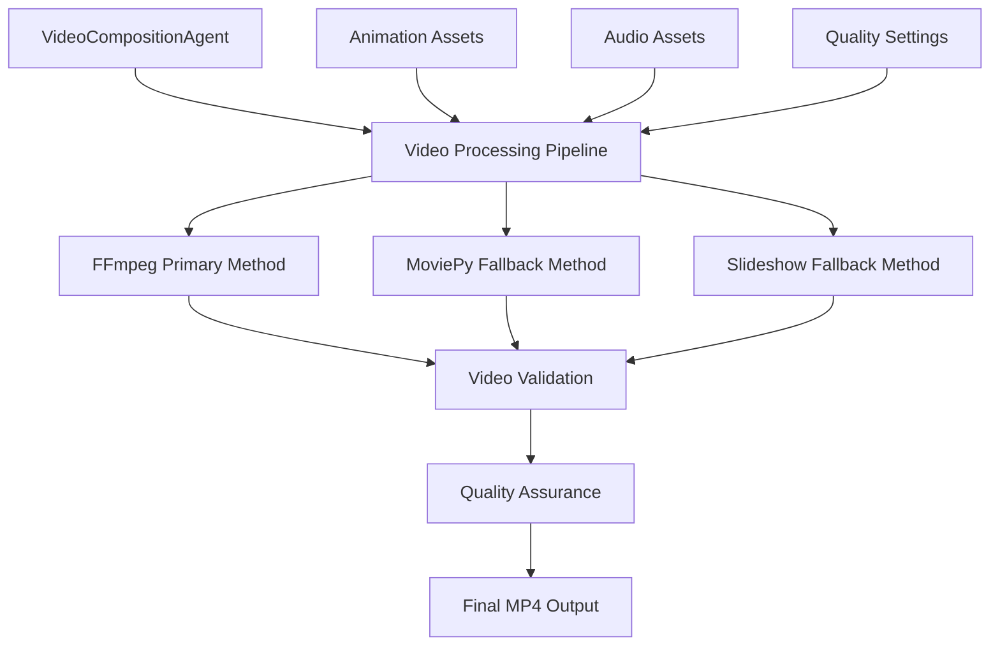
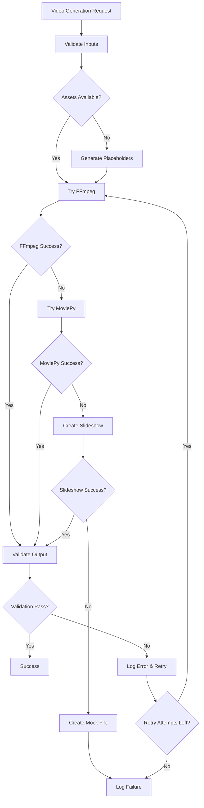

# Design Document: Production Video Generation

## Overview

This design document outlines the implementation of production-quality video generation for the RASO platform. The current system generates mock text files with .mp4 extensions, which need to be replaced with real MP4 videos that meet professional standards and YouTube specifications.

The solution implements a robust video processing pipeline using FFmpeg as the primary tool, with MoviePy as a fallback, and includes comprehensive video validation, multiple quality presets, and proper error handling.

## Architecture

### High-Level Architecture



### Processing Pipeline Flow

1. **Input Validation**: Verify animation and audio assets exist
2. **Quality Selection**: Choose appropriate quality preset (low/medium/high)
3. **Primary Processing**: Attempt video composition with FFmpeg
4. **Fallback Processing**: Use MoviePy if FFmpeg fails
5. **Last Resort**: Create slideshow with audio if both fail
6. **Video Validation**: Verify output format, duration, and playability
7. **Quality Assurance**: Check file size, codec compliance, and metadata
8. **State Update**: Update RASOMasterState with real video information

## Components and Interfaces

### VideoCompositionAgent (Enhanced)

**Primary Responsibilities:**
- Orchestrate video composition process
- Manage quality presets and encoding parameters
- Handle fallback methods and error recovery
- Validate output videos for compliance

**Key Methods:**
```python
async def _compose_video_production(animations, audio, output_path, quality="medium") -> bool
async def _validate_video_output(video_path: str) -> ValidationResult
async def _apply_quality_preset(quality: str) -> EncodingParams
async def _install_ffmpeg_if_missing() -> bool
```

### FFmpegVideoProcessor

**Responsibilities:**
- Handle FFmpeg-based video composition
- Manage scene concatenation and audio synchronization
- Apply encoding parameters for different quality levels
- Generate placeholder content when assets are missing

**Key Methods:**
```python
async def compose_scenes(scenes: List[Scene], quality: QualityPreset) -> str
async def validate_ffmpeg_installation() -> bool
async def create_placeholder_video(duration: float, resolution: str) -> str
async def synchronize_audio_video(video_path: str, audio_path: str) -> str
```

### MoviePyVideoProcessor

**Responsibilities:**
- Fallback video composition using MoviePy
- Handle video clip manipulation and concatenation
- Apply transitions and effects
- Export with proper codec settings

**Key Methods:**
```python
async def compose_with_moviepy(scenes: List[Scene], quality: QualityPreset) -> str
def create_video_clip(scene: Scene) -> VideoFileClip
def apply_transitions(clips: List[VideoFileClip]) -> VideoFileClip
```

### VideoValidator

**Responsibilities:**
- Validate video format compliance (MP4, H.264, AAC)
- Check video duration matches expected duration
- Verify file integrity and playability
- Validate metadata and chapter markers

**Key Methods:**
```python
async def validate_format(video_path: str) -> FormatValidation
async def validate_duration(video_path: str, expected_duration: float) -> bool
async def validate_codecs(video_path: str) -> CodecValidation
async def validate_metadata(video_path: str) -> MetadataValidation
```

### QualityPresetManager

**Responsibilities:**
- Manage different quality presets (low/medium/high)
- Provide encoding parameters for each quality level
- Handle custom quality configurations
- Optimize settings for different use cases

**Quality Presets:**
```python
QUALITY_PRESETS = {
    "low": {
        "resolution": "1280x720",
        "bitrate": "3500k",
        "crf": 28,
        "preset": "fast"
    },
    "medium": {
        "resolution": "1920x1080", 
        "bitrate": "5500k",
        "crf": 23,
        "preset": "medium"
    },
    "high": {
        "resolution": "1920x1080",
        "bitrate": "8500k", 
        "crf": 18,
        "preset": "slow"
    }
}
```

## Data Models

### Enhanced VideoAsset Model

```python
@dataclass
class VideoAsset:
    file_path: str
    duration: float
    resolution: str
    file_size: int
    metadata: VideoMetadata
    chapters: List[Chapter]
    
    # New fields for production quality
    codec_info: CodecInfo
    quality_preset: str
    validation_status: ValidationStatus
    processing_method: str  # "ffmpeg", "moviepy", "slideshow"
```

### ValidationResult Model

```python
@dataclass
class ValidationResult:
    is_valid: bool
    format_valid: bool
    duration_valid: bool
    codec_valid: bool
    metadata_valid: bool
    file_size_valid: bool
    errors: List[str]
    warnings: List[str]
```

### EncodingParams Model

```python
@dataclass
class EncodingParams:
    resolution: str
    bitrate: str
    crf: int
    preset: str
    fps: int
    audio_codec: str
    video_codec: str
    pixel_format: str
```

## Correctness Properties

*A property is a characteristic or behavior that should hold true across all valid executions of a system-essentially, a formal statement about what the system should do. Properties serve as the bridge between human-readable specifications and machine-verifiable correctness guarantees.*

### Converting EARS to Properties

Based on the prework analysis, I've identified the testable acceptance criteria and consolidated redundant properties. Here are the key correctness properties:

**Property 1: Valid MP4 Generation**
*For any* video composition request, the system should generate a valid MP4 file with proper container format, H.264 video codec, and AAC audio codec that can be opened by standard video players
**Validates: Requirements 1.1, 1.2, 1.4, 4.1**

**Property 2: Quality Preset Compliance**
*For any* quality preset selection (low/medium/high), the generated video should match the specified resolution and bitrate ranges: low (720p, 3-4 Mbps), medium (1080p, 5-6 Mbps), high (1080p, 8-10 Mbps)
**Validates: Requirements 2.1, 2.4, 5.1, 5.2, 5.3, 5.4**

**Property 3: File Size and Format Standards**
*For any* generated video, the file size should be greater than 1MB for typical research papers and maintain proper encoding parameters (CRF 23, 30 FPS, YUV 4:2:0 pixel format)
**Validates: Requirements 1.3, 2.2, 2.3, 2.5**

**Property 4: Audio-Video Synchronization**
*For any* combination of audio and video assets, the final video should have perfectly synchronized audio and video tracks with consistent 44.1 kHz sample rate and normalized audio levels across scenes
**Validates: Requirements 3.1, 3.2, 3.4**

**Property 5: Duration Consistency**
*For any* video generation, the final video duration should match the total duration of audio assets, with individual scenes matching their corresponding audio narration duration
**Validates: Requirements 3.3, 7.3, 9.2**

**Property 6: Fallback Processing Pipeline**
*For any* video generation request, the system should attempt FFmpeg first, fall back to MoviePy if FFmpeg fails, then create slideshow if both fail, and only create mock files as absolute last resort
**Validates: Requirements 1.5, 6.1, 6.2, 6.3**

**Property 7: Missing Asset Handling**
*For any* missing audio files, the system should generate silent audio tracks to maintain video structure and timing
**Validates: Requirements 3.5**

**Property 8: YouTube Compliance**
*For any* generated video, it should meet YouTube specifications including 16:9 aspect ratio, proper metadata fields (title, description, tags), and file size under 128GB limit
**Validates: Requirements 4.2, 4.3, 4.4**

**Property 9: Chapter Marker Generation**
*For any* multi-scene video, chapter markers should be generated at scene boundaries for navigation within the video
**Validates: Requirements 4.5, 7.5**

**Property 10: Scene Composition**
*For any* multiple animation scenes, they should be combined into a single cohesive video with smooth transitions between scenes
**Validates: Requirements 7.1, 7.2**

**Property 11: Video Validation**
*For any* generated video, the system should validate format compliance, duration accuracy, codec correctness, and playability using FFprobe and standard video libraries
**Validates: Requirements 6.4, 9.1, 9.3, 9.4**

**Property 12: Performance Requirements**
*For any* typical research paper video (5-10 minutes), generation should complete within 2 minutes using hardware acceleration when available and parallel processing for multiple scenes
**Validates: Requirements 8.1, 8.2, 8.3**

**Property 13: Progress Reporting and Cleanup**
*For any* video generation process, progress updates should be provided during composition and temporary files should be cleaned up after successful generation
**Validates: Requirements 8.4, 8.5**

**Property 14: Error Handling and Recovery**
*For any* video generation failure, the system should log detailed error information, provide recovery suggestions, and attempt regeneration if validation fails
**Validates: Requirements 6.5, 9.5**

**Property 15: Backward Compatibility**
*For any* existing animation and audio assets, the new system should work without modification while maintaining the same interface, state management, and configuration compatibility
**Validates: Requirements 10.1, 10.2, 10.3, 10.4, 10.5**

**Property 16: Custom Quality Parameters**
*For any* custom resolution and quality parameters provided through processing options, the system should apply them correctly to the generated video
**Validates: Requirements 5.5**

## Error Handling

### Error Categories and Recovery Strategies

**1. FFmpeg Installation Issues**
- **Detection**: Check FFmpeg availability during agent initialization
- **Recovery**: Provide clear installation instructions and fall back to MoviePy
- **User Guidance**: Display system-specific installation commands

**2. Video Composition Failures**
- **Detection**: Monitor subprocess return codes and output validation
- **Recovery**: Automatic fallback through processing pipeline (FFmpeg → MoviePy → Slideshow)
- **Logging**: Capture detailed error messages and processing attempts

**3. Asset Availability Issues**
- **Detection**: Check file existence before processing
- **Recovery**: Generate placeholder content (silent audio, placeholder video)
- **Graceful Degradation**: Continue processing with available assets

**4. Validation Failures**
- **Detection**: Use FFprobe and video library validation
- **Recovery**: Attempt regeneration with different parameters
- **Quality Assurance**: Ensure only valid videos are delivered

**5. Performance Issues**
- **Detection**: Monitor processing time and resource usage
- **Recovery**: Adjust quality settings or processing methods
- **Optimization**: Use hardware acceleration when available

### Error Recovery Flow



## Testing Strategy

### Dual Testing Approach

The testing strategy employs both unit tests and property-based tests to ensure comprehensive coverage:

**Unit Tests:**
- Test specific examples and edge cases
- Validate integration points between components
- Test error conditions and recovery mechanisms
- Verify specific codec and format requirements

**Property-Based Tests:**
- Verify universal properties across all inputs
- Test with randomized video parameters and asset combinations
- Validate correctness properties with minimum 100 iterations per test
- Each property test references its corresponding design document property

### Property-Based Testing Configuration

**Testing Framework**: Use `hypothesis` for Python property-based testing
**Minimum Iterations**: 100 per property test
**Test Tagging**: Each test tagged with format: **Feature: production-video-generation, Property {number}: {property_text}**

### Test Categories

**1. Format Compliance Tests**
- Validate MP4 container format
- Verify H.264/AAC codec usage
- Check resolution and aspect ratio compliance
- Test metadata presence and accuracy

**2. Quality Assurance Tests**
- Verify bitrate ranges for each quality preset
- Test frame rate consistency (30 FPS)
- Validate color space and pixel format
- Check file size requirements

**3. Audio-Video Synchronization Tests**
- Test timing alignment between tracks
- Verify audio sample rate consistency
- Test audio normalization across scenes
- Validate duration matching

**4. Processing Pipeline Tests**
- Test fallback method sequence
- Verify error handling and recovery
- Test with missing or corrupted assets
- Validate cleanup and temporary file management

**5. Performance and Integration Tests**
- Test generation time requirements
- Verify hardware acceleration usage
- Test parallel processing capabilities
- Validate backward compatibility

### Test Data Generation

**Smart Generators:**
- Generate realistic video durations (30 seconds to 20 minutes)
- Create varied scene counts (1-10 scenes per video)
- Generate different quality preset combinations
- Create realistic audio/video asset scenarios

**Edge Case Coverage:**
- Very short videos (< 10 seconds)
- Very long videos (> 30 minutes)
- Missing audio or video assets
- Corrupted input files
- Extreme quality settings

### Validation Testing

**FFprobe Integration:**
- Automated format validation using FFprobe
- Codec compliance verification
- Duration and metadata accuracy checks
- File integrity validation

**Cross-Platform Testing:**
- Test on Windows, macOS, and Linux
- Verify different FFmpeg versions
- Test with various video players
- Validate YouTube upload compatibility