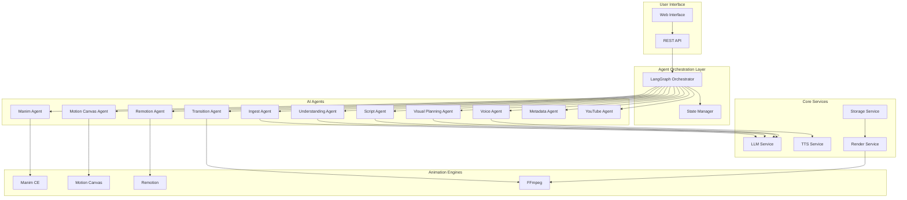
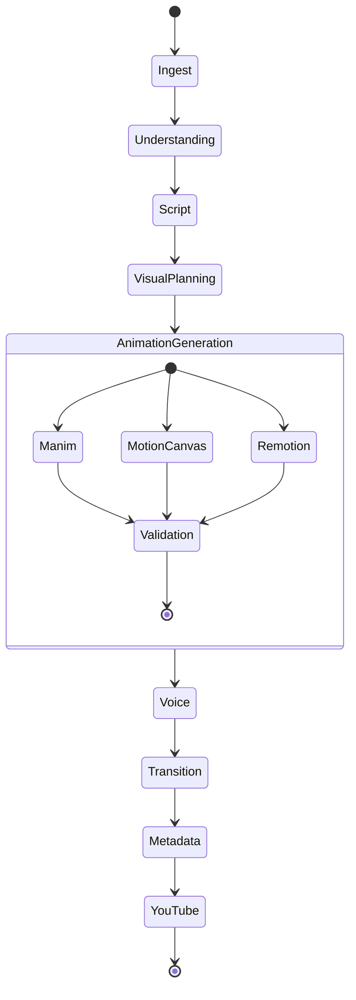

# RASO Platform Design Document

## Overview

RASO (Research paper Automated Simulation & Orchestration Platform) is a production-ready, open-source AI platform that transforms research papers into professional-quality animated videos. The system employs a multi-agent architecture orchestrated through LangGraph, combining local AI models with specialized animation frameworks to create YouTube-ready educational content.

The platform follows a local-first approach, using open-source tools by default while supporting optional cloud-based AI services. The architecture emphasizes modularity, reliability, and extensibility to support future enhancements and community contributions.

## Architecture

### High-Level Architecture



### Agent Workflow



## Components and Interfaces

### LangGraph State Schema

```typescript
interface RASOMasterState {
  // Input
  paperInput: PaperInput;
  
  // Processing State
  paperContent: PaperContent;
  understanding: PaperUnderstanding;
  script: NarrationScript;
  visualPlan: VisualPlan;
  animations: AnimationAssets;
  audio: AudioAssets;
  video: VideoAsset;
  metadata: VideoMetadata;
  
  // Control
  currentAgent: string;
  errors: AgentError[];
  retryCount: number;
  status: WorkflowStatus;
}

interface PaperInput {
  type: 'title' | 'arxiv' | 'pdf';
  content: string; // title text, URL, or base64 PDF
  options?: ProcessingOptions;
}

interface PaperContent {
  title: string;
  authors: string[];
  abstract: string;
  sections: Section[];
  equations: Equation[];
  figures: Figure[];
  references: Reference[];
}

interface PaperUnderstanding {
  problem: string;
  intuition: string;
  contributions: string[];
  keyEquations: KeyEquation[];
  visualizableConcepts: VisualizableConcept[];
}

interface NarrationScript {
  scenes: Scene[];
  totalDuration: number;
  wordCount: number;
}

interface Scene {
  id: string;
  title: string;
  narration: string;
  duration: number;
  visualType: 'manim' | 'motion-canvas' | 'remotion';
  concepts: string[];
}

interface VisualPlan {
  scenes: ScenePlan[];
  transitions: TransitionPlan[];
  overallStyle: StyleGuide;
}

interface ScenePlan {
  sceneId: string;
  framework: 'manim' | 'motion-canvas' | 'remotion';
  template: string;
  parameters: Record<string, any>;
  duration: number;
}
```

### Agent Interfaces

#### Base Agent Interface

```typescript
abstract class BaseAgent {
  abstract name: string;
  abstract description: string;
  
  abstract execute(state: RASOMasterState): Promise<RASOMasterState>;
  
  protected validateInput(state: RASOMasterState): void;
  protected handleError(error: Error, state: RASOMasterState): RASOMasterState;
  protected logProgress(message: string, state: RASOMasterState): void;
}
```

#### Specialized Agent Interfaces

```typescript
interface IngestAgent extends BaseAgent {
  extractFromTitle(title: string): Promise<PaperContent>;
  extractFromArxiv(url: string): Promise<PaperContent>;
  extractFromPDF(pdfData: Buffer): Promise<PaperContent>;
}

interface UnderstandingAgent extends BaseAgent {
  analyzeProblem(content: PaperContent): Promise<string>;
  extractContributions(content: PaperContent): Promise<string[]>;
  identifyKeyEquations(content: PaperContent): Promise<KeyEquation[]>;
  findVisualizableConcepts(content: PaperContent): Promise<VisualizableConcept[]>;
}

interface AnimationAgent extends BaseAgent {
  generateCode(plan: ScenePlan, narration: string): Promise<string>;
  validateCode(code: string): Promise<boolean>;
  renderScene(code: string): Promise<string>; // returns path to rendered video
}
```

## Data Models

### Core Data Models

```typescript
// Paper Content Models
interface Section {
  id: string;
  title: string;
  content: string;
  level: number; // 1 for main sections, 2 for subsections, etc.
  equations: string[]; // references to equation IDs
  figures: string[]; // references to figure IDs
}

interface Equation {
  id: string;
  latex: string;
  description?: string;
  sectionId: string;
  isKey: boolean; // marked as important for visualization
}

interface Figure {
  id: string;
  caption: string;
  imageData?: Buffer;
  sectionId: string;
  type: 'diagram' | 'chart' | 'photo' | 'illustration';
}

// Understanding Models
interface KeyEquation {
  equationId: string;
  importance: number; // 1-10 scale
  visualizationHint: string;
  relatedConcepts: string[];
}

interface VisualizableConcept {
  name: string;
  description: string;
  visualizationType: 'animation' | 'diagram' | 'chart' | 'simulation';
  complexity: 'simple' | 'medium' | 'complex';
  relatedEquations: string[];
}

// Animation Models
interface AnimationAssets {
  scenes: RenderedScene[];
  totalDuration: number;
  resolution: VideoResolution;
}

interface RenderedScene {
  sceneId: string;
  filePath: string;
  duration: number;
  framework: string;
  metadata: SceneMetadata;
}

interface AudioAssets {
  scenes: AudioScene[];
  totalDuration: number;
  sampleRate: number;
}

interface AudioScene {
  sceneId: string;
  filePath: string;
  duration: number;
  transcript: string;
  timingMarkers: TimingMarker[];
}

interface VideoAsset {
  filePath: string;
  duration: number;
  resolution: VideoResolution;
  fileSize: number;
  chapters: Chapter[];
}

interface VideoMetadata {
  title: string;
  description: string;
  tags: string[];
  chapters: Chapter[];
  thumbnail?: string;
  category: string;
}
```

### Animation Template Models

```typescript
interface AnimationTemplate {
  id: string;
  name: string;
  framework: 'manim' | 'motion-canvas' | 'remotion';
  description: string;
  parameters: TemplateParameter[];
  codeTemplate: string;
  safetyLevel: 'safe' | 'restricted' | 'unsafe';
}

interface TemplateParameter {
  name: string;
  type: 'string' | 'number' | 'boolean' | 'array' | 'object';
  required: boolean;
  defaultValue?: any;
  validation?: ValidationRule;
}

interface ValidationRule {
  pattern?: string; // regex for strings
  min?: number; // for numbers
  max?: number; // for numbers
  allowedValues?: any[]; // enum-like validation
}
```

## Correctness Properties

*A property is a characteristic or behavior that should hold true across all valid executions of a system-essentially, a formal statement about what the system should do. Properties serve as the bridge between human-readable specifications and machine-verifiable correctness guarantees.*

### Property Reflection

After analyzing all acceptance criteria, several properties can be consolidated to eliminate redundancy:

**Consolidations Made:**
- Properties 1.1, 1.2, 1.3 (paper ingestion) can be combined into a single comprehensive ingestion property
- Properties 4.2, 4.3, 4.4 (framework assignment) can be combined into a single assignment rule property  
- Properties 6.1, 6.2, 6.4 (audio generation and processing) can be combined into a comprehensive audio property
- Properties 8.1, 8.2, 8.3, 8.4 (metadata generation) can be combined into a single metadata completeness property
- Properties 9.2, 9.3, 9.5 (upload process) can be combined into a single upload workflow property
- Properties 11.1, 11.2, 11.3 (agent architecture) can be combined into a single architectural compliance property

**Properties Removed:**
- Subjective quality properties (3.4, 3.5, 6.3, 7.4) that cannot be programmatically verified
- Properties that are fully implied by others (e.g., individual framework assignments when covered by comprehensive assignment property)

### Correctness Properties

Property 1: Paper ingestion completeness
*For any* valid paper input (title, arXiv URL, or PDF), the system should successfully extract structured content including sections, equations, figures, and metadata, with validation of completeness
**Validates: Requirements 1.1, 1.2, 1.3, 1.4**

Property 2: Error handling consistency  
*For any* invalid or failing input, the system should provide clear error messages with suggested remediation steps and graceful degradation
**Validates: Requirements 1.5, 12.2**

Property 3: Paper understanding completeness
*For any* successfully ingested paper, the understanding phase should produce a complete analysis including problem statement, contributions, key equations, and visualizable concepts
**Validates: Requirements 2.1, 2.2, 2.3, 2.4, 2.5**

Property 4: Script generation structure
*For any* paper understanding, the script generation should produce scene-wise narration that maps logically to paper sections with educational tone and YouTube-friendly language
**Validates: Requirements 3.1, 3.2, 3.3**

Property 5: Framework assignment rules
*For any* content type, the visual planning should assign the appropriate animation framework (Manim for math, Motion Canvas for concepts, Remotion for UI) and generate complete scene plans
**Validates: Requirements 4.1, 4.2, 4.3, 4.4, 4.5**

Property 6: Animation safety and validation
*For any* generated animation code, the system should use only safe templates, validate syntax before execution, and implement retry mechanisms with fallback templates on failure
**Validates: Requirements 5.1, 5.2, 5.3, 5.4, 5.5**

Property 7: Audio-visual synchronization
*For any* scene with narration, the audio generation should produce synchronized voiceover with proper timing, volume normalization, and automatic adjustment capabilities
**Validates: Requirements 6.1, 6.2, 6.4, 6.5**

Property 8: Video composition consistency
*For any* set of rendered scenes, the composition should combine them into a single 1080p MP4 file with smooth transitions, synchronized audio, and YouTube-compliant formatting
**Validates: Requirements 7.1, 7.2, 7.3, 7.5**

Property 9: Metadata generation completeness
*For any* completed video, the system should generate comprehensive YouTube metadata including SEO-optimized title, complete description, relevant tags, and chapter markers that map to paper structure
**Validates: Requirements 8.1, 8.2, 8.3, 8.4, 8.5**

Property 10: YouTube integration workflow
*For any* enabled YouTube integration, the system should handle authentication, apply metadata during upload, monitor progress, implement retry logic on failure, and return confirmation on success
**Validates: Requirements 9.1, 9.2, 9.3, 9.4, 9.5**

Property 11: Local-first operation
*For any* system deployment, the platform should operate entirely with local resources and open-source software by default, with external APIs as optional enhancements that don't break core functionality
**Validates: Requirements 10.1, 10.2, 10.3, 10.4, 10.5**

Property 12: Agent architecture compliance
*For any* system operation, the platform should use LangGraph orchestration with stateless agents, JSON-based communication with schema enforcement, and comprehensive state tracking
**Validates: Requirements 11.1, 11.2, 11.3, 11.4, 11.5**

Property 13: Failure recovery mechanisms
*For any* system failure, the platform should implement automatic retry with exponential backoff, preserve partial progress, enable workflow resumption, and maintain comprehensive logs for debugging
**Validates: Requirements 12.1, 12.3, 12.4, 12.5**

## Error Handling

### Error Categories

1. **Input Validation Errors**
   - Invalid paper formats or corrupted files
   - Malformed URLs or inaccessible arXiv papers
   - Missing required fields or parameters

2. **Processing Errors**
   - LLM service failures or timeouts
   - Animation rendering failures
   - TTS generation errors
   - Video composition failures

3. **External Service Errors**
   - Network connectivity issues
   - YouTube API failures
   - Third-party service rate limiting

4. **Resource Constraints**
   - Insufficient disk space
   - Memory limitations
   - CPU overload

### Error Handling Strategies

```typescript
interface ErrorHandlingStrategy {
  category: ErrorCategory;
  retryPolicy: RetryPolicy;
  fallbackAction: FallbackAction;
  userNotification: NotificationLevel;
  logLevel: LogLevel;
}

interface RetryPolicy {
  maxAttempts: number;
  backoffStrategy: 'exponential' | 'linear' | 'fixed';
  baseDelay: number;
  maxDelay: number;
  retryableErrors: string[];
}

interface FallbackAction {
  type: 'degrade' | 'skip' | 'substitute' | 'abort';
  parameters: Record<string, any>;
}
```

### Graceful Degradation

- **LLM Failures**: Fall back to simpler templates or cached responses
- **Animation Failures**: Use static images or simplified animations
- **TTS Failures**: Provide text-only output with timing information
- **Upload Failures**: Save locally with manual upload instructions

## Testing Strategy

### Dual Testing Approach

The RASO platform employs both unit testing and property-based testing to ensure comprehensive coverage:

- **Unit tests** verify specific examples, edge cases, and integration points between components
- **Property tests** verify universal properties that should hold across all inputs using property-based testing
- Together they provide complete coverage: unit tests catch concrete bugs, property tests verify general correctness

### Property-Based Testing Framework

**Framework Selection**: We will use **Hypothesis** (Python) as our property-based testing library for the core agent logic, with **fast-check** (TypeScript) for frontend components.

**Configuration Requirements**:
- Each property-based test MUST run a minimum of 100 iterations to ensure statistical confidence
- Each property-based test MUST be tagged with a comment explicitly referencing the correctness property from this design document
- Tag format: `**Feature: raso-platform, Property {number}: {property_text}**`
- Each correctness property MUST be implemented by a SINGLE property-based test

### Unit Testing Strategy

Unit tests will focus on:
- **Specific Examples**: Known paper inputs with expected outputs
- **Edge Cases**: Empty content, malformed inputs, boundary conditions  
- **Integration Points**: Agent communication, state transitions, external service interfaces
- **Error Conditions**: Validation failures, service timeouts, resource constraints

### Test Data Strategy

- **Synthetic Papers**: Generated test papers with known characteristics
- **Real Paper Samples**: Curated set of actual research papers for integration testing
- **Mock Services**: Controllable implementations of external dependencies
- **Performance Benchmarks**: Timing and resource usage validation

### Continuous Testing

- **Pre-commit Hooks**: Run fast unit tests before code commits
- **CI Pipeline**: Full test suite including property tests on pull requests
- **Integration Testing**: End-to-end workflows with real services in staging
- **Performance Testing**: Resource usage and timing validation

## Implementation Architecture

### Service Layer Design

```typescript
// Core Services
interface LLMService {
  generateCompletion(prompt: string, model?: string): Promise<string>;
  validateResponse(response: string, schema: JSONSchema): boolean;
  getAvailableModels(): Promise<string[]>;
}

interface TTSService {
  generateSpeech(text: string, voice?: string): Promise<AudioBuffer>;
  getVoiceOptions(): Promise<VoiceOption[]>;
  estimateDuration(text: string): number;
}

interface RenderService {
  renderManim(code: string): Promise<string>;
  renderMotionCanvas(code: string): Promise<string>;
  renderRemotion(code: string): Promise<string>;
  composeVideo(scenes: string[], audio: string[]): Promise<string>;
}

interface StorageService {
  saveAsset(data: Buffer, type: AssetType): Promise<string>;
  loadAsset(path: string): Promise<Buffer>;
  cleanupAssets(jobId: string): Promise<void>;
  getStorageStats(): Promise<StorageStats>;
}
```

### Configuration Management

```typescript
interface RASOMasterConfig {
  // LLM Configuration
  llm: {
    provider: 'ollama' | 'openai' | 'claude' | 'gemini';
    model: string;
    apiKey?: string;
    baseUrl?: string;
    timeout: number;
  };
  
  // Animation Configuration
  animation: {
    resolution: VideoResolution;
    frameRate: number;
    quality: 'draft' | 'standard' | 'high';
    templates: TemplateConfig;
  };
  
  // Audio Configuration
  audio: {
    ttsProvider: 'coqui' | 'espeak' | 'festival';
    voice: string;
    sampleRate: number;
    bitRate: number;
  };
  
  // YouTube Configuration
  youtube?: {
    clientId: string;
    clientSecret: string;
    refreshToken: string;
    defaultCategory: string;
    defaultPrivacy: 'public' | 'unlisted' | 'private';
  };
  
  // System Configuration
  system: {
    maxConcurrentJobs: number;
    tempDirectory: string;
    logLevel: LogLevel;
    retryAttempts: number;
  };
}
```

### Deployment Architecture

```yaml
# docker-compose.yml structure
version: '3.8'
services:
  raso-api:
    build: ./backend
    ports:
      - "8000:8000"
    environment:
      - RASO_CONFIG_PATH=/app/config
    volumes:
      - ./config:/app/config
      - ./data:/app/data
    depends_on:
      - ollama
      - redis
  
  raso-frontend:
    build: ./frontend
    ports:
      - "3000:3000"
    depends_on:
      - raso-api
  
  ollama:
    image: ollama/ollama
    ports:
      - "11434:11434"
    volumes:
      - ollama_data:/root/.ollama
  
  redis:
    image: redis:alpine
    ports:
      - "6379:6379"
    volumes:
      - redis_data:/data
  
  animation-worker:
    build: ./animation
    volumes:
      - ./data:/app/data
    depends_on:
      - redis
```

This design provides a comprehensive foundation for building the RASO platform with proper separation of concerns, robust error handling, and extensive testing capabilities. The architecture supports both local-first operation and optional cloud enhancements while maintaining modularity and extensibility.