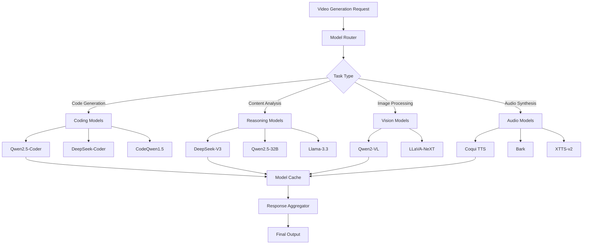

# AI Model Integration Guide

## Overview

This guide provides detailed instructions for integrating and configuring AI models in the production video generation system, including setup procedures, configuration options, and optimization techniques for 16GB RAM systems.

## Table of Contents

1. [Integration Architecture](#integration-architecture)
2. [Model Installation and Setup](#model-installation-and-setup)
3. [Configuration Management](#configuration-management)
4. [Model Switching and Routing](#model-switching-and-routing)
5. [Performance Optimization](#performance-optimization)
6. [Error Handling and Fallbacks](#error-handling-and-fallbacks)
7. [Monitoring and Logging](#monitoring-and-logging)

## Integration Architecture

### Model Service Architecture



### Model Integration Components

#### ModelManager Class
```python
class ModelManager:
    """Central model management and integration system."""
    
    def __init__(self, config_path: str = "config/production_config_2024.json"):
        self.config = self._load_config(config_path)
        self.loaded_models = {}
        self.model_cache = ModelCache(max_size=2)  # For 16GB systems
        self.performance_monitor = PerformanceMonitor()
        
    def get_model(self, task_type: str, quality_preset: str = "balanced") -> AIModel:
        """Get optimal model for task type and quality preset."""
        model_config = self._select_model(task_type, quality_preset)
        
        if model_config['name'] not in self.loaded_models:
            model = self._load_model(model_config)
            self.loaded_models[model_config['name']] = model
            
        return self.loaded_models[model_config['name']]
    
    def _select_model(self, task_type: str, quality_preset: str) -> dict:
        """Select optimal model based on task and quality requirements."""
        preset_config = self.config['ai_models']['presets'][quality_preset]
        
        model_mapping = {
            'coding': preset_config['models']['coding'],
            'reasoning': preset_config['models']['reasoning'],
            'vision': preset_config['models']['vision'],
            'audio': preset_config['models']['audio']
        }
        
        return {
            'name': model_mapping[task_type],
            'config': preset_config,
            'task_type': task_type
        }
```

#### Model Router
```python
class ModelRouter:
    """Route requests to appropriate models based on content analysis."""
    
    def __init__(self, model_manager: ModelManager):
        self.model_manager = model_manager
        self.task_classifier = TaskClassifier()
        
    async def route_request(self, request: GenerationRequest) -> GenerationResponse:
        """Route request to optimal model combination."""
        # Analyze request to determine required models
        required_models = self._analyze_request(request)
        
        # Execute tasks in optimal order
        results = {}
        for task_type, task_data in required_models.items():
            model = self.model_manager.get_model(
                task_type, 
                request.quality_preset
            )
            results[task_type] = await model.process(task_data)
        
        # Combine results
        return self._combine_results(results, request)
    
    def _analyze_request(self, request: GenerationRequest) -> dict:
        """Analyze request to determine required model types."""
        required_models = {}
        
        # Check if code generation is needed
        if self._needs_code_generation(request):
            required_models['coding'] = {
                'type': 'manim_generation',
                'content': request.content,
                'complexity': self._assess_complexity(request)
            }
        
        # Check if content analysis is needed
        if self._needs_content_analysis(request):
            required_models['reasoning'] = {
                'type': 'content_understanding',
                'content': request.content,
                'target_audience': request.target_audience
            }
        
        # Check if image processing is needed
        if request.images:
            required_models['vision'] = {
                'type': 'image_analysis',
                'images': request.images,
                'analysis_type': 'scientific_diagram'
            }
        
        # Audio synthesis is always needed
        required_models['audio'] = {
            'type': 'text_to_speech',
            'text': request.script,
            'voice_config': request.voice_config
        }
        
        return required_models
```

## Model Installation and Setup

### Ollama Integration Setup

#### Installation Script
```bash
#!/bin/bash
# install_ai_models.sh - Install and configure AI models for 16GB systems

echo "Installing Ollama..."
curl -fsSL https://ollama.ai/install.sh | sh

echo "Starting Ollama service..."
ollama serve &
sleep 10

echo "Installing optimized models for 16GB RAM systems..."

# Coding models
echo "Installing coding models..."
ollama pull codellama:7b-instruct-q4_K_M
ollama pull qwen2.5-coder:7b-instruct-q4_K_M

# Reasoning models  
echo "Installing reasoning models..."
ollama pull qwen2.5:7b-instruct-q4_K_M
ollama pull qwen2.5:14b-instruct-q4_K_M

# Vision models
echo "Installing vision models..."
ollama pull llava:7b-q4_K_M
ollama pull qwen2-vl:7b-q4_K_M

echo "Model installation complete!"
echo "Testing model functionality..."

# Test each model
ollama run codellama:7b-instruct-q4_K_M "def hello_world():"
ollama run qwen2.5:7b-instruct-q4_K_M "Explain machine learning briefly"
ollama run llava:7b-q4_K_M "Describe this image" < test_image.jpg

echo "All models installed and tested successfully!"
```

#### Python Integration
```python
import ollama
import asyncio
from typing import Dict, List, Optional

class OllamaIntegration:
    """Integration with Ollama for local AI model serving."""
    
    def __init__(self, base_url: str = "http://localhost:11434"):
        self.client = ollama.Client(host=base_url)
        self.available_models = self._get_available_models()
        
    def _get_available_models(self) -> List[str]:
        """Get list of available models."""
        try:
            models = self.client.list()
            return [model['name'] for model in models['models']]
        except Exception as e:
            print(f"Error getting models: {e}")
            return []
    
    async def generate_code(self, prompt: str, model: str = "qwen2.5-coder:7b-instruct-q4_K_M") -> str:
        """Generate code using coding model."""
        try:
            response = self.client.generate(
                model=model,
                prompt=prompt,
                options={
                    'temperature': 0.1,  # Low temperature for code generation
                    'top_p': 0.9,
                    'max_tokens': 2048
                }
            )
            return response['response']
        except Exception as e:
            print(f"Code generation error: {e}")
            return ""
    
    async def analyze_content(self, content: str, model: str = "qwen2.5:14b-instruct-q4_K_M") -> str:
        """Analyze content using reasoning model."""
        try:
            response = self.client.generate(
                model=model,
                prompt=f"Analyze this content and provide insights:\n\n{content}",
                options={
                    'temperature': 0.3,
                    'top_p': 0.9,
                    'max_tokens': 1024
                }
            )
            return response['response']
        except Exception as e:
            print(f"Content analysis error: {e}")
            return ""
    
    async def analyze_image(self, image_path: str, prompt: str, model: str = "qwen2-vl:7b-q4_K_M") -> str:
        """Analyze image using vision model."""
        try:
            with open(image_path, 'rb') as image_file:
                response = self.client.generate(
                    model=model,
                    prompt=prompt,
                    images=[image_file.read()],
                    options={
                        'temperature': 0.2,
                        'max_tokens': 512
                    }
                )
            return response['response']
        except Exception as e:
            print(f"Image analysis error: {e}")
            return ""
```

### Audio Model Integration

#### Coqui TTS Setup
```python
import torch
from TTS.api import TTS
from TTS.tts.configs.xtts_config import XttsConfig
from TTS.tts.models.xtts import Xtts

class CoquiTTSIntegration:
    """Integration with Coqui TTS for high-quality audio synthesis."""
    
    def __init__(self, model_name: str = "tts_models/multilingual/multi-dataset/xtts_v2"):
        self.device = "cuda" if torch.cuda.is_available() else "cpu"
        self.tts = TTS(model_name).to(self.device)
        
    def synthesize_speech(self, text: str, speaker_wav: str = None, language: str = "en") -> str:
        """Synthesize speech from text."""
        output_path = f"output/audio_{hash(text)}.wav"
        
        if speaker_wav:
            # Voice cloning
            self.tts.tts_to_file(
                text=text,
                speaker_wav=speaker_wav,
                language=language,
                file_path=output_path
            )
        else:
            # Default voice
            self.tts.tts_to_file(
                text=text,
                file_path=output_path
            )
        
        return output_path
    
    def clone_voice(self, reference_audio: str, text: str, language: str = "en") -> str:
        """Clone voice from reference audio."""
        output_path = f"output/cloned_{hash(text)}.wav"
        
        self.tts.tts_to_file(
            text=text,
            speaker_wav=reference_audio,
            language=language,
            file_path=output_path
        )
        
        return output_path
```

#### Bark Integration
```python
from bark import SAMPLE_RATE, generate_audio, preload_models
from scipy.io.wavfile import write as write_wav
import numpy as np

class BarkIntegration:
    """Integration with Bark for creative audio generation."""
    
    def __init__(self):
        # Preload models for faster generation
        preload_models()
        
    def generate_creative_audio(self, text: str, voice_preset: str = "v2/en_speaker_6") -> str:
        """Generate creative audio with emotions and effects."""
        # Generate audio array
        audio_array = generate_audio(text, history_prompt=voice_preset)
        
        # Save to file
        output_path = f"output/bark_{hash(text)}.wav"
        write_wav(output_path, SAMPLE_RATE, audio_array)
        
        return output_path
    
    def generate_with_emotions(self, text: str, emotion: str = "excited") -> str:
        """Generate audio with specific emotions."""
        # Add emotion markers to text
        emotional_text = f"[{emotion}] {text}"
        
        audio_array = generate_audio(emotional_text)
        output_path = f"output/emotional_{hash(text)}.wav"
        write_wav(output_path, SAMPLE_RATE, audio_array)
        
        return output_path
```

## Configuration Management

### Dynamic Configuration System
```python
class ConfigurationManager:
    """Manage AI model configurations dynamically."""
    
    def __init__(self, config_path: str):
        self.config_path = config_path
        self.config = self._load_config()
        self.hardware_profile = self._detect_hardware()
        
    def _detect_hardware(self) -> dict:
        """Detect system hardware capabilities."""
        import psutil
        import GPUtil
        
        # Get RAM information
        memory = psutil.virtual_memory()
        total_ram_gb = memory.total / (1024**3)
        
        # Get GPU information
        gpus = GPUtil.getGPUs()
        gpu_memory_gb = gpus[0].memoryTotal / 1024 if gpus else 0
        
        # Get CPU information
        cpu_count = psutil.cpu_count()
        
        return {
            'ram_gb': total_ram_gb,
            'gpu_memory_gb': gpu_memory_gb,
            'cpu_cores': cpu_count,
            'has_gpu': len(gpus) > 0
        }
    
    def get_optimal_preset(self) -> str:
        """Get optimal preset based on hardware."""
        ram_gb = self.hardware_profile['ram_gb']
        
        if ram_gb <= 16:
            return "fast_16gb"
        elif ram_gb <= 32:
            return "balanced_16gb" if ram_gb < 20 else "quality_32gb"
        else:
            return "quality_32gb"
    
    def update_config_for_hardware(self):
        """Update configuration based on detected hardware."""
        optimal_preset = self.get_optimal_preset()
        
        # Update model selections
        self.config['default_preset'] = optimal_preset
        
        # Adjust memory limits
        if self.hardware_profile['ram_gb'] <= 16:
            self.config['memory_limits'] = {
                'max_model_memory': '12GB',
                'cache_size': '2GB',
                'concurrent_models': 1
            }
        
        # Save updated configuration
        self._save_config()
    
    def _save_config(self):
        """Save configuration to file."""
        import json
        with open(self.config_path, 'w') as f:
            json.dump(self.config, f, indent=2)
```

### Environment-Specific Configurations
```python
# Development configuration (16GB RAM)
DEVELOPMENT_CONFIG = {
    "models": {
        "coding": "codellama:7b-instruct-q4_K_M",
        "reasoning": "qwen2.5:7b-instruct-q4_K_M",
        "vision": "llava:7b-q4_K_M",
        "audio": "piper-tts-fast"
    },
    "performance": {
        "max_concurrent_models": 2,
        "memory_limit": "12GB",
        "inference_timeout": "30s",
        "cache_size": "2GB"
    },
    "optimization": {
        "quantization": "4-bit",
        "context_length": 2048,
        "batch_size": 1,
        "enable_gpu": True
    }
}

# Production configuration (16GB RAM + Swap)
PRODUCTION_CONFIG = {
    "models": {
        "coding": "qwen2.5-coder:7b-instruct-q4_K_M",
        "reasoning": "qwen2.5:14b-instruct-q4_K_M",
        "vision": "qwen2-vl:7b-q4_K_M",
        "audio": "coqui-tts-medium"
    },
    "performance": {
        "max_concurrent_models": 1,
        "memory_limit": "16GB",
        "inference_timeout": "60s",
        "cache_size": "1GB"
    },
    "optimization": {
        "quantization": "4-bit",
        "context_length": 4096,
        "batch_size": 1,
        "enable_swap": True
    }
}
```

## Model Switching and Routing

### Intelligent Model Selection
```python
class IntelligentModelSelector:
    """Select optimal models based on task complexity and system resources."""
    
    def __init__(self, config_manager: ConfigurationManager):
        self.config_manager = config_manager
        self.performance_history = {}
        
    def select_model(self, task_type: str, content_complexity: str, quality_requirement: str) -> str:
        """Select optimal model based on multiple factors."""
        # Get available models for task type
        available_models = self._get_available_models(task_type)
        
        # Score models based on requirements
        model_scores = {}
        for model in available_models:
            score = self._calculate_model_score(
                model, content_complexity, quality_requirement
            )
            model_scores[model] = score
        
        # Select highest scoring model that fits in memory
        return self._select_best_fitting_model(model_scores)
    
    def _calculate_model_score(self, model: str, complexity: str, quality: str) -> float:
        """Calculate model suitability score."""
        model_info = self._get_model_info(model)
        
        # Base score from model capabilities
        capability_score = model_info['accuracy'] / 100.0
        
        # Adjust for complexity requirements
        complexity_multiplier = {
            'simple': 0.8,
            'medium': 1.0,
            'complex': 1.2
        }.get(complexity, 1.0)
        
        # Adjust for quality requirements
        quality_multiplier = {
            'fast': 0.7,
            'balanced': 1.0,
            'high': 1.3
        }.get(quality, 1.0)
        
        # Consider performance history
        performance_multiplier = self._get_performance_multiplier(model)
        
        return capability_score * complexity_multiplier * quality_multiplier * performance_multiplier
    
    def _select_best_fitting_model(self, model_scores: dict) -> str:
        """Select best model that fits in available memory."""
        available_memory = self._get_available_memory()
        
        # Sort models by score
        sorted_models = sorted(model_scores.items(), key=lambda x: x[1], reverse=True)
        
        # Select first model that fits in memory
        for model, score in sorted_models:
            model_memory = self._get_model_memory_requirement(model)
            if model_memory <= available_memory:
                return model
        
        # Fallback to smallest model if none fit
        return self._get_smallest_model()
```

### Dynamic Model Loading
```python
class DynamicModelLoader:
    """Load and unload models dynamically based on usage patterns."""
    
    def __init__(self, max_memory_gb: int = 12):
        self.max_memory = max_memory_gb * 1024**3
        self.loaded_models = {}
        self.usage_stats = {}
        self.loading_queue = asyncio.Queue()
        
    async def load_model_async(self, model_name: str) -> AIModel:
        """Load model asynchronously with memory management."""
        if model_name in self.loaded_models:
            self._update_usage_stats(model_name)
            return self.loaded_models[model_name]
        
        # Check if we need to free memory
        await self._ensure_memory_available(model_name)
        
        # Load model
        model = await self._load_model_impl(model_name)
        self.loaded_models[model_name] = model
        self._update_usage_stats(model_name)
        
        return model
    
    async def _ensure_memory_available(self, model_name: str):
        """Ensure sufficient memory is available for model loading."""
        required_memory = self._get_model_memory_requirement(model_name)
        current_usage = self._get_current_memory_usage()
        
        while current_usage + required_memory > self.max_memory:
            # Unload least recently used model
            lru_model = self._get_least_recently_used_model()
            if lru_model:
                await self._unload_model(lru_model)
                current_usage = self._get_current_memory_usage()
            else:
                break
    
    async def _unload_model(self, model_name: str):
        """Unload model from memory."""
        if model_name in self.loaded_models:
            del self.loaded_models[model_name]
            # Force garbage collection
            import gc
            gc.collect()
            print(f"Unloaded model: {model_name}")
```

## Performance Optimization

### Memory Optimization Strategies
```python
class MemoryOptimizer:
    """Optimize memory usage for AI models on 16GB systems."""
    
    def __init__(self):
        self.memory_monitor = MemoryMonitor()
        self.optimization_strategies = [
            self._enable_quantization,
            self._reduce_context_length,
            self._enable_model_offloading,
            self._optimize_batch_size
        ]
    
    def optimize_for_16gb(self, model_config: dict) -> dict:
        """Apply optimizations for 16GB RAM systems."""
        optimized_config = model_config.copy()
        
        # Apply each optimization strategy
        for strategy in self.optimization_strategies:
            optimized_config = strategy(optimized_config)
        
        return optimized_config
    
    def _enable_quantization(self, config: dict) -> dict:
        """Enable 4-bit quantization for memory efficiency."""
        if 'quantization' not in config:
            config['quantization'] = '4-bit'
        
        # Use quantized model variants
        model_mappings = {
            'qwen2.5-coder:32b': 'qwen2.5-coder:7b-instruct-q4_K_M',
            'deepseek-v3:67b': 'qwen2.5:14b-instruct-q4_K_M',
            'llama3.3:70b': 'qwen2.5:14b-instruct-q4_K_M'
        }
        
        for original, quantized in model_mappings.items():
            if config.get('model') == original:
                config['model'] = quantized
        
        return config
    
    def _reduce_context_length(self, config: dict) -> dict:
        """Reduce context length to save memory."""
        config['context_length'] = min(config.get('context_length', 4096), 4096)
        return config
    
    def _enable_model_offloading(self, config: dict) -> dict:
        """Enable CPU offloading for large models."""
        config['cpu_offload'] = True
        config['gpu_layers'] = min(config.get('gpu_layers', 20), 20)
        return config
    
    def _optimize_batch_size(self, config: dict) -> dict:
        """Optimize batch size for memory constraints."""
        config['batch_size'] = 1  # Sequential processing for 16GB systems
        return config
```

### GPU Acceleration Optimization
```python
class GPUOptimizer:
    """Optimize GPU usage for AI model inference."""
    
    def __init__(self):
        self.gpu_available = self._check_gpu_availability()
        self.gpu_memory = self._get_gpu_memory()
        
    def optimize_gpu_usage(self, model_config: dict) -> dict:
        """Optimize GPU settings based on available hardware."""
        if not self.gpu_available:
            return self._cpu_only_config(model_config)
        
        optimized_config = model_config.copy()
        
        # Configure GPU memory usage
        optimized_config['gpu_memory_fraction'] = 0.8
        optimized_config['allow_growth'] = True
        
        # Enable mixed precision for speed
        optimized_config['mixed_precision'] = True
        
        # Optimize for specific GPU types
        gpu_type = self._detect_gpu_type()
        if gpu_type == 'RTX':
            optimized_config['enable_tensor_cores'] = True
        
        return optimized_config
    
    def _check_gpu_availability(self) -> bool:
        """Check if GPU is available for acceleration."""
        try:
            import torch
            return torch.cuda.is_available()
        except ImportError:
            return False
    
    def _get_gpu_memory(self) -> int:
        """Get available GPU memory in GB."""
        try:
            import GPUtil
            gpus = GPUtil.getGPUs()
            return gpus[0].memoryTotal / 1024 if gpus else 0
        except ImportError:
            return 0
```

## Error Handling and Fallbacks

### Robust Error Handling System
```python
class ModelErrorHandler:
    """Handle errors and implement fallback strategies."""
    
    def __init__(self):
        self.fallback_models = {
            'coding': ['qwen2.5-coder:7b', 'codellama:7b', 'simple_code_generator'],
            'reasoning': ['qwen2.5:14b', 'qwen2.5:7b', 'simple_text_generator'],
            'vision': ['qwen2-vl:7b', 'llava:7b', 'basic_image_processor'],
            'audio': ['coqui-tts', 'piper-tts', 'basic_tts']
        }
        
    async def execute_with_fallback(self, task_type: str, task_data: dict) -> dict:
        """Execute task with automatic fallback on failure."""
        models = self.fallback_models[task_type]
        
        for i, model_name in enumerate(models):
            try:
                model = await self._load_model(model_name)
                result = await model.process(task_data)
                
                if self._validate_result(result):
                    return {
                        'result': result,
                        'model_used': model_name,
                        'fallback_level': i
                    }
                    
            except Exception as e:
                print(f"Model {model_name} failed: {e}")
                if i < len(models) - 1:
                    print(f"Falling back to {models[i+1]}")
                    continue
                else:
                    raise Exception(f"All fallback models failed for task type: {task_type}")
        
        raise Exception(f"No working model found for task type: {task_type}")
    
    def _validate_result(self, result: dict) -> bool:
        """Validate model output quality."""
        if not result or 'output' not in result:
            return False
        
        output = result['output']
        
        # Basic validation checks
        if len(output.strip()) < 10:  # Too short
            return False
        
        if 'error' in output.lower() or 'failed' in output.lower():
            return False
        
        return True
```

### Circuit Breaker Pattern
```python
class ModelCircuitBreaker:
    """Implement circuit breaker pattern for model reliability."""
    
    def __init__(self, failure_threshold: int = 5, recovery_timeout: int = 60):
        self.failure_threshold = failure_threshold
        self.recovery_timeout = recovery_timeout
        self.failure_counts = {}
        self.last_failure_times = {}
        self.circuit_states = {}  # 'closed', 'open', 'half-open'
        
    async def call_with_circuit_breaker(self, model_name: str, func, *args, **kwargs):
        """Call function with circuit breaker protection."""
        state = self.circuit_states.get(model_name, 'closed')
        
        if state == 'open':
            if self._should_attempt_reset(model_name):
                self.circuit_states[model_name] = 'half-open'
            else:
                raise Exception(f"Circuit breaker open for model: {model_name}")
        
        try:
            result = await func(*args, **kwargs)
            
            # Success - reset failure count
            self.failure_counts[model_name] = 0
            self.circuit_states[model_name] = 'closed'
            
            return result
            
        except Exception as e:
            self._record_failure(model_name)
            
            if self.failure_counts[model_name] >= self.failure_threshold:
                self.circuit_states[model_name] = 'open'
                self.last_failure_times[model_name] = time.time()
            
            raise e
    
    def _record_failure(self, model_name: str):
        """Record a failure for the model."""
        self.failure_counts[model_name] = self.failure_counts.get(model_name, 0) + 1
    
    def _should_attempt_reset(self, model_name: str) -> bool:
        """Check if circuit breaker should attempt reset."""
        last_failure = self.last_failure_times.get(model_name, 0)
        return time.time() - last_failure > self.recovery_timeout
```

## Monitoring and Logging

### Performance Monitoring
```python
class ModelPerformanceMonitor:
    """Monitor AI model performance and resource usage."""
    
    def __init__(self):
        self.metrics = {}
        self.performance_history = []
        
    def record_inference(self, model_name: str, task_type: str, 
                        duration: float, memory_used: int, quality_score: float):
        """Record inference performance metrics."""
        timestamp = time.time()
        
        metric = {
            'timestamp': timestamp,
            'model_name': model_name,
            'task_type': task_type,
            'duration': duration,
            'memory_used': memory_used,
            'quality_score': quality_score,
            'tokens_per_second': self._calculate_tokens_per_second(duration)
        }
        
        self.performance_history.append(metric)
        self._update_aggregated_metrics(model_name, metric)
    
    def get_model_performance_summary(self, model_name: str) -> dict:
        """Get performance summary for a specific model."""
        model_metrics = [m for m in self.performance_history if m['model_name'] == model_name]
        
        if not model_metrics:
            return {}
        
        return {
            'average_duration': sum(m['duration'] for m in model_metrics) / len(model_metrics),
            'average_memory': sum(m['memory_used'] for m in model_metrics) / len(model_metrics),
            'average_quality': sum(m['quality_score'] for m in model_metrics) / len(model_metrics),
            'total_inferences': len(model_metrics),
            'success_rate': self._calculate_success_rate(model_name)
        }
    
    def generate_performance_report(self) -> str:
        """Generate comprehensive performance report."""
        report = "AI Model Performance Report\n"
        report += "=" * 40 + "\n\n"
        
        for model_name in set(m['model_name'] for m in self.performance_history):
            summary = self.get_model_performance_summary(model_name)
            report += f"Model: {model_name}\n"
            report += f"  Average Duration: {summary['average_duration']:.2f}s\n"
            report += f"  Average Memory: {summary['average_memory']:.1f}MB\n"
            report += f"  Average Quality: {summary['average_quality']:.2f}\n"
            report += f"  Success Rate: {summary['success_rate']:.1%}\n\n"
        
        return report
```

### Comprehensive Logging System
```python
import logging
from datetime import datetime

class ModelLogger:
    """Comprehensive logging system for AI model operations."""
    
    def __init__(self, log_level: str = "INFO"):
        self.logger = logging.getLogger("AIModelIntegration")
        self.logger.setLevel(getattr(logging, log_level))
        
        # Create formatters
        formatter = logging.Formatter(
            '%(asctime)s - %(name)s - %(levelname)s - %(message)s'
        )
        
        # File handler for persistent logging
        file_handler = logging.FileHandler('logs/ai_models.log')
        file_handler.setFormatter(formatter)
        self.logger.addHandler(file_handler)
        
        # Console handler for immediate feedback
        console_handler = logging.StreamHandler()
        console_handler.setFormatter(formatter)
        self.logger.addHandler(console_handler)
    
    def log_model_loading(self, model_name: str, duration: float, memory_used: int):
        """Log model loading events."""
        self.logger.info(
            f"Model loaded: {model_name} | Duration: {duration:.2f}s | Memory: {memory_used}MB"
        )
    
    def log_inference(self, model_name: str, task_type: str, duration: float, success: bool):
        """Log inference events."""
        status = "SUCCESS" if success else "FAILED"
        self.logger.info(
            f"Inference {status}: {model_name} | Task: {task_type} | Duration: {duration:.2f}s"
        )
    
    def log_error(self, model_name: str, error: Exception, context: dict = None):
        """Log errors with context."""
        error_msg = f"Model error: {model_name} | Error: {str(error)}"
        if context:
            error_msg += f" | Context: {context}"
        self.logger.error(error_msg)
    
    def log_performance_warning(self, model_name: str, metric: str, value: float, threshold: float):
        """Log performance warnings."""
        self.logger.warning(
            f"Performance warning: {model_name} | {metric}: {value} exceeds threshold: {threshold}"
        )
```

This comprehensive integration guide provides all the necessary components for successfully integrating AI models into the production video generation system, with specific optimizations for 16GB RAM systems.